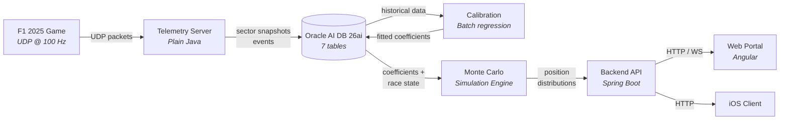
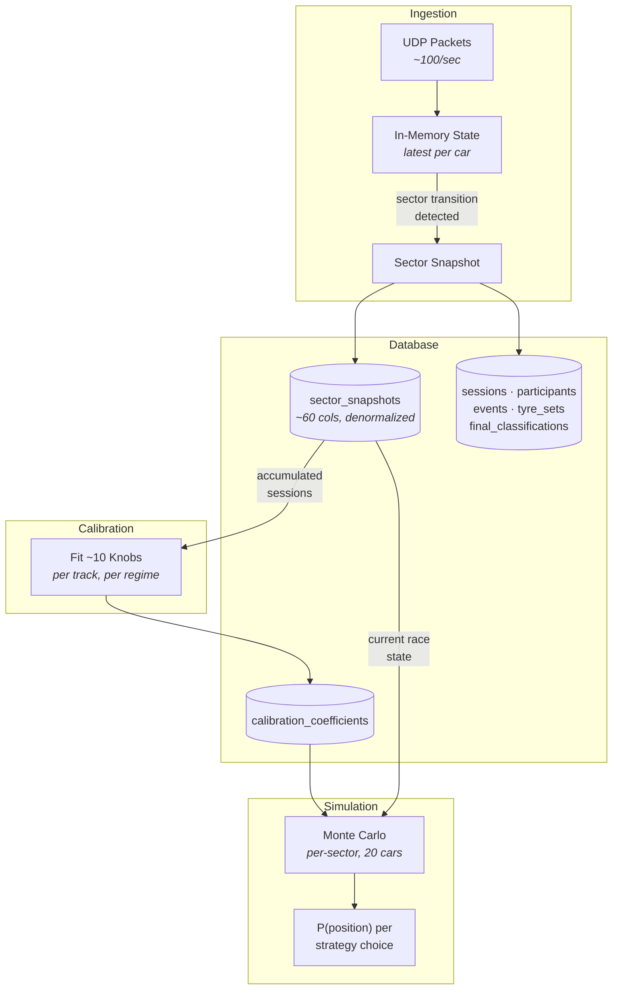

# F1 2025 Race Strategy Simulation

A proof-of-concept system that ingests real-time telemetry from the F1 2025 game, stores per-sector snapshots in Oracle AI Database 26ai, calibrates physics models from accumulated data, and runs Monte Carlo simulations to predict race outcomes under different pit strategy choices.

## Architecture



### Data Flow

The system operates as three independent pipelines that share the database:

**1. Ingestion** — The telemetry server listens for UDP packets from the F1 2025 game (~80–100 packets/sec). It maintains an in-memory snapshot of all 20 cars and writes to the database only on **sector transitions** (3 per lap × 20 cars ≈ 60 rows/lap). Discrete events (safety car, penalties, retirements, collisions) are captured immediately.

**2. Calibration** — After each session ends, a batch process reads all accumulated sector snapshots for the track and fits ~10 model knobs (base pace, tyre degradation, fuel effect, dirty air, DRS advantage, damage, weather, overtake probability, etc.). Coefficients are fitted **separately for Player and AI cars** because the game uses different physics models for each.

**3. Simulation** — During a race the simulation engine loads the fitted coefficients and current race state, then runs 1,000–10,000 Monte Carlo iterations at per-sector granularity. Each iteration samples from the calibrated distributions to project sector times, overtakes, and pit stop outcomes. The output is a probability distribution of finishing positions for each strategy choice.



## Modules

| Module | Role | Tech |
|--------|------|------|
| `telemetry/` | UDP server: receives F1 2025 packets, maintains in-memory state, snapshots on sector transitions | Plain Java 21, Oracle UCP, Oracle JDBC |
| `backend/` | HTTP/WS API: bridges portal and iOS client with database and simulation engine | Spring Boot 3.5.3, Java 23 |
| `portal/` | Web UI: session setup, live telemetry dashboard, strategy simulation results | Angular 21 |
| `simulator/` | Calibration pipeline and Monte Carlo simulation engine | TBD |
| `database/` | Oracle AI Database 26ai schema (7 tables), migrations | TBD |
| `client/` | iOS app: real-time race engineer display for the driver | TBD |

### Key Design Choices

- **Plain Java for ingestion** — No HTTP needed; a blocking UDP socket loop with 2 dependencies (Oracle UCP + Oracle JDBC) starts instantly and handles the packet rate with minimal overhead.
- **Raw JDBC over ORM** — 99% inserts into flat, denormalized tables. Batch `addBatch()`/`executeBatch()` outperforms entity lifecycle management; analytical reads are aggregates (`AVG`, `GROUP BY`), not object graphs.
- **Per-sector granularity** — Captures sector-specific overtakes, DRS zones, and dirty air effects that per-lap resolution would miss. 3× more rows but still manageable (~60/lap).
- **Snapshot-on-transition** — Instead of storing every packet, the server keeps the latest state in memory and writes only when a sector boundary is crossed. Reduces DB volume by ~99%.
- **Dual calibration regimes** — Separate PLAYER and AI coefficient sets because the game applies different physics to each. Player data accumulates 19× slower (1 car vs 19).
- **Intentional denormalization** — Weather, tyre wear (4 wheels × 3 metrics), car damage (8 components), and temperatures are stored as flat columns in `sector_snapshots` because they are always read together and never sparse.

## Running

### Telemetry Server

```bash
cd telemetry && ./gradlew run
```

Listens on UDP port 20777 (configurable in `src/main/resources/config.properties`). Point the F1 2025 game's telemetry output to this address.

**Test client** (simulates F1 25 telemetry):

```bash
cd telemetry && ./gradlew runClient
```

### Backend

```bash
cd backend && ./gradlew bootRun
```

Runs on http://localhost:8080.

### Portal

```bash
cd portal && npm start
```

Runs on http://localhost:4200, proxies API/WS calls to the backend.

## Docs

- `design/` — Architecture decisions, database schema, calibration pipeline, Monte Carlo simulation design
- `docs/` — F1 25 telemetry UDP specification and packet structures
- `reports/` — Design rationale and research reports
