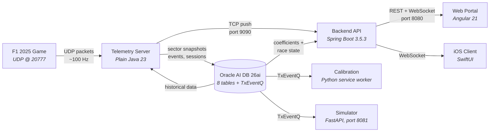
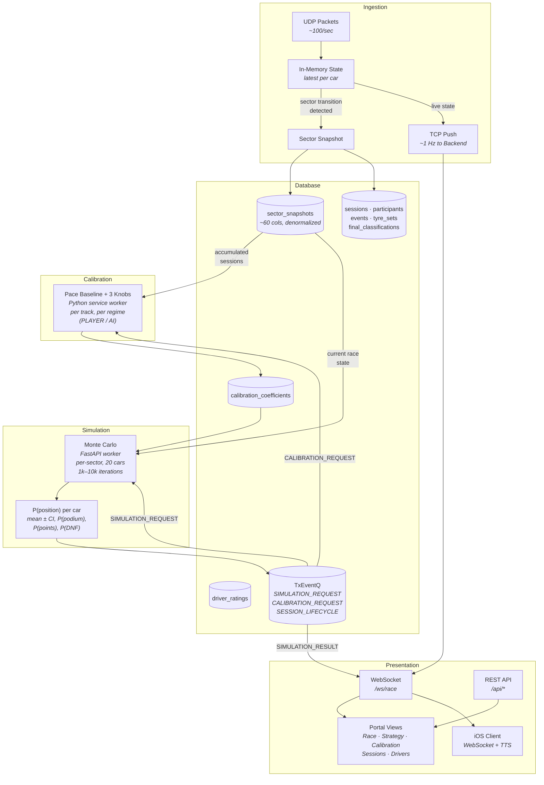

# F1 2025 Race Strategy Simulation

A proof-of-concept system that ingests real-time telemetry from the F1 2025 game, stores per-sector snapshots in Oracle AI Database 26ai, calibrates physics models from accumulated data, and runs Monte Carlo simulations to predict race outcomes under different pit strategy choices.

## Architecture



### Data Flow

The system operates as five connected pipelines:

**1. Ingestion** — The telemetry server listens for UDP packets from the F1 2025 game (~80–100 packets/sec). It maintains an in-memory snapshot of all 20 cars and writes to the database only on **sector transitions** (3 per lap × 20 cars ≈ 60 rows/lap). Discrete events (safety car, penalties, retirements, collisions) are captured immediately. Live race state is pushed to the backend via **TCP (port 9090)** at ~1 Hz.

**2. Calibration** — The backend enqueues calibration requests via **Oracle TxEventQ**. A Python service worker (`calibration/`) reads all accumulated sector snapshots for the track and fits a per-car pace baseline plus 3 model knobs (tyre degradation per compound, fuel effect, pit stop time loss). Coefficients are fitted **separately for Player and AI cars** because the game uses different physics models for each.

**3. Simulation** — During a race the backend enqueues simulation requests via **TxEventQ**. The simulator service (`simulator/`, FastAPI on port 8081) runs a Monte Carlo engine (1,000–10,000 iterations with early stopping) that loads the fitted coefficients and current race state, then simulates at per-sector granularity. Each iteration samples from the calibrated distributions to project sector times, overtakes, and pit stop outcomes. The output is a probability distribution of finishing positions for each car. Simulations auto-trigger on lap completions, pit stops, safety car deployments, and disruptive events (with 3-second debounce).

**4. Presentation** — The backend broadcasts simulation results, calibration status, and live race state to the portal via WebSocket. The portal provides five views: live race table, strategy comparison, calibration dashboard, session browser, and drivers overview.

**5. Race Engineer** — The iOS client connects to the backend via WebSocket, receives race engineer messages (strategy advice, warnings, status updates), and speaks them aloud using text-to-speech — acting as a real-time voice assistant for the driver.



## Modules

| Module         | Role                                                                                                                                                   | Tech                                    |
| -------------- | ------------------------------------------------------------------------------------------------------------------------------------------------------ | --------------------------------------- |
| `telemetry/`   | UDP server: receives F1 2025 packets, maintains in-memory state, snapshots on sector transitions, pushes live state via TCP                            | Plain Java 23, Oracle UCP, Oracle JDBC  |
| `backend/`     | REST/WebSocket API: bridges portal and clients with database, orchestrates calibration and simulation triggers via TxEventQ                            | Spring Boot 3.5.3, Java 23              |
| `calibration/` | Always-on worker: consumes `CALIBRATION_REQUEST` from TxEventQ, runs outlier detection + sklearn/numpy fitting of physics model coefficients per track | Python 3.12+, sklearn, numpy            |
| `simulator/`   | Monte Carlo race strategy simulation service, consumes TxEventQ requests                                                                               | Python 3.12+, FastAPI                   |
| `portal/`      | Web UI: live race table, strategy comparison, calibration dashboard, session browser, drivers overview                                                 | Angular 21                              |
| `database/`    | Oracle AI Database 26ai schema (8 tables + TxEventQ queues), Liquibase migrations                                                                      | Liquibase, SQL                          |
| `client/`      | iOS app: real-time race engineer voice assistant for the driver                                                                                        | SwiftUI, WebSocket, AVSpeechSynthesizer |

### Key Design Choices

- **Plain Java for ingestion** — No HTTP needed; a blocking UDP socket loop with 2 dependencies (Oracle UCP + Oracle JDBC) starts instantly and handles the packet rate with minimal overhead.
- **Raw JDBC over ORM** — 99% inserts into flat, denormalized tables. Batch `addBatch()`/`executeBatch()` outperforms entity lifecycle management; analytical reads are aggregates (`AVG`, `GROUP BY`), not object graphs.
- **Per-sector granularity** — Captures sector-specific overtakes, DRS zones, and dirty air effects that per-lap resolution would miss. 3× more rows but still manageable (~60/lap).
- **Snapshot-on-transition** — Instead of storing every packet, the server keeps the latest state in memory and writes only when a sector boundary is crossed. Reduces DB volume by ~99%.
- **TCP push for live state** — Telemetry pushes race state to backend at ~1 Hz over TCP (newline-delimited JSON), avoiding polling and enabling real-time WebSocket broadcast to the portal.
- **Dual calibration regimes** — Separate PLAYER and AI coefficient sets because the game applies different physics to each. Player data accumulates 19× slower (1 car vs 19).
- **Intentional denormalization** — Weather, tyre wear (4 wheels × 3 metrics), car damage (8 components), and temperatures are stored as flat columns in `sector_snapshots` because they are always read together and never sparse.

## Running

### Prerequisites

- Java 23
- Python 3.12+
- Node 22+
- Podman (for Oracle + the compose stack)
- SQLcl 24.3+ (optional, for the Oracle MCP server)
- Xcode (optional, for the iOS client)

### Quick start

From a clean clone:

```bash
python -m venv venv                  # one-time: create virtualenv at project root
source venv/bin/activate             # Windows: venv\Scripts\activate
pip install -r requirements.txt      # installs manage.py + podman-compose
```

```bash
python manage.py local setup         # Oracle container + Liquibase + generated configs + Java build (~5-6 min)
podman compose up --build -d         # build + start telemetry, backend, simulator, calibration, portal
```

Check endpoints and point the F1 2025 game at the right UDP target:

```bash
python manage.py info                # consolidated endpoints + game setup info
podman compose ps                    # container status
podman compose logs -f <service>     # follow one service's log (e.g. backend)
```

Portal is at http://localhost:4200. Logs from all services land in `logs/` at the repo root.

### Rebuild & redeploy after code changes

The compose images bundle each service's build output, so source edits don't propagate to a running container — you have to rebuild and recreate. Build the Java artifacts first, then rebuild and recreate every service in one shot:

```bash
(cd backend && ./gradlew bootJar) && (cd telemetry && ./gradlew installDist)
podman compose up -d --build --force-recreate
```

`backend` and `telemetry` pick up the freshly built jars; `simulator`, `calibration`, and `portal` copy their source at image build time so no separate build step is needed for them.

If a session was already live before the redeploy, the backend has no in-memory state for it. Telemetry only emits `sessionStarted` once per session UID, so the easiest way to re-arm the pipeline is to exit and re-enter the session in the F1 game.

### Clean up

```bash
podman compose down                  # stop and remove the 5 service containers
python manage.py local clean         # stop Oracle + remove container + clear password from .env
```

### Database backup & restore

Export all session + calibration data to a timestamped SQL file under `database/backups/`:

```bash
python manage.py local export
```

Import the latest backup (or pass an explicit path):

```bash
python manage.py local import
python manage.py local import database/backups/export_20250101_120000.sql
```

### Oracle MCP Server (optional)

Enables Claude Code to query the database directly via SQLcl's MCP server.

```bash
python manage.py mcp setup           # create SQLcl saved connection (f1strategy_local)
```

The project includes a `.mcp.json` that configures the SQLcl MCP server. After running the setup, restart Claude Code to pick up the connection.

### Troubleshooting

- **Backend or telemetry container exits immediately after `podman compose up`.** The Java images bundle `application.properties` / `config.properties` at build time. If the jars were built before `manage.py local setup` generated those configs (or after a subsequent setup regenerated the password), the bundled configs are stale. Re-run the setup — it rebuilds the Java artifacts at the end — then compose up again with `--build`:

  ```bash
  podman compose down
  python manage.py local setup
  podman compose up --build -d
  ```

- **`ORA-28000: the account is locked`.** Too many failed logins. Unlock and reset the counter:

  ```bash
  python manage.py local unlock
  ```

- **`podman machine is not running` (macOS).** Start the Podman VM:

  ```bash
  podman machine start
  ```

- **`manage.py local status` shows the container is not running.** Start it with `podman start f1strategy_db`, or run `python manage.py local setup` again (it will recreate the container if it doesn't exist).

### Running services in separate terminals (for development)

When iterating on a single service it's often faster to run it directly on the host than rebuild the container. Start Oracle with `python manage.py local setup` first, then one of the following per terminal.

#### Telemetry server

```bash
cd telemetry && ./gradlew run
```

Listens on UDP port 20777 (configurable in `src/main/resources/config.properties`). Point the F1 2025 game's telemetry output to this address.

Test client (simulates F1 25 telemetry):

```bash
cd telemetry && ./gradlew runClient
```

#### Backend

```bash
cd backend && ./gradlew bootRun
```

Runs on http://localhost:8080. Connects to telemetry via TCP on port 9090.

#### Calibration

```bash
cd calibration
python -m venv venv                  # one-time
source venv/bin/activate
pip install -r requirements.txt
cd ..
python -m calibration
```

Long-lived worker that consumes `CALIBRATION_REQUEST` from TxEventQ.

#### Simulator

```bash
cd simulator
python -m venv venv                  # one-time
source venv/bin/activate
pip install -r requirements.txt
cd ..
python -m simulator
```

Runs on http://localhost:8081. Can run without Oracle for testing:

```bash
SIMULATOR_USE_DB=false python -m simulator
```

#### Portal

```bash
cd portal && npm start
```

Runs on http://localhost:4200, proxies `/api` and `/ws` calls to the backend.

#### iOS Client

Xcode project in `client/Virtual Race Engineer/`. Open in Xcode and run on a device or simulator.

## Docs

- `design/` — Architecture decisions, database schema, calibration pipeline, Monte Carlo simulation design
- `docs/` — F1 25 telemetry UDP specification and packet structures
