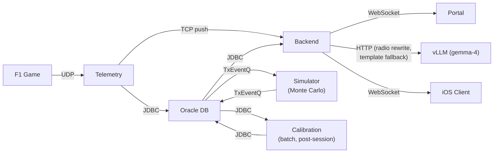

# Introduction

## What This Project Does

This system ingests real-time telemetry from the EA Sports F1 2025 video game, fits statistical models to the observed data, and runs Monte Carlo simulations ([Metropolis & Ulam, 1949](10-REFERENCES.md#metropolis1949)) to predict race outcomes under different pit stop strategies. The output is a probability distribution of finishing positions for each car — the kind of analysis a real F1 strategy team would produce ([Brawn & Parr, 2016](10-REFERENCES.md#brawn2016)), applied to a game environment where the underlying physics model is unknown and must be reverse-engineered from data.

A native iOS app delivers the simulation results as spoken race engineer messages during the race, turning the predictions into actionable radio calls ("Box this lap, switch to hards, you'll gain two positions").

## Why It Exists

This is a proof-of-concept (PoC) built as a final-year thesis project (TFG) for UNIR. It demonstrates end-to-end data engineering, statistical modeling, and real-time system integration — from a UDP byte stream at 20 Hz to a voice telling you when to pit.

## System at a Glance

Six components work together, plus two external dependencies — the Oracle database and a vLLM inference server:

| Component       | Tech              | Role                                                                                                                                                          |
| --------------- | ----------------- | ------------------------------------------------------------------------------------------------------------------------------------------------------------- |
| **Telemetry**   | Plain Java 23     | Receives F1 25 UDP packets, writes per-sector snapshots to Oracle, pushes live state to Backend via TCP                                                       |
| **Database**    | Oracle AI 26ai    | Stores sessions, sector snapshots, events, calibration coefficients. TxEventQ queues decouple components                                                      |
| **Backend**     | Spring Boot 3.5.3 | REST + WebSocket API, orchestrates calibration and simulation triggers via TxEventQ                                                                           |
| **Calibration** | Python 3.12+      | Service worker that fits a per-car pace baseline plus 4 model knobs (tyre degradation, tyre wear-rate, fuel effect, pit stop time loss) from accumulated data |
| **Simulator**   | Python / FastAPI  | Monte Carlo engine: 1K-10K iterations at per-sector granularity, produces position probability distributions                                                  |
| **Portal**      | Angular 21        | Live Race dashboard, plus a System observability dashboard (data-coverage, calibration confidence, predicted-vs-actual accuracy, diagnostics)                 |
| **iOS Client**  | SwiftUI           | Receives race engineer messages via WebSocket, speaks them aloud with priority-based TTS                                                                      |
| **vLLM server** | vLLM (OpenAI API) | External inference host; rewrites each race-engineer message into natural radio voice (gemma-4) via `/v1/chat/completions`, with template fallback            |

## Key Design Decisions

- **Per-sector granularity** — The simulation operates at sector level (3 per lap), not lap level. This captures DRS zones, dirty air, overtakes, and sector-specific effects that per-lap averages would lose.
- **Dual calibration** — The game runs different physics for AI cars and the player car. All model coefficients are fitted separately for each regime.
- **Snapshot-on-transition** — Instead of storing every UDP packet (~100/sec), the telemetry server buffers state in memory and writes only when a sector boundary is crossed (~60 rows/lap).
- **TxEventQ decoupling** — Calibration and simulation are triggered via Oracle TxEventQ message queues ([Oracle Corporation, 2025](10-REFERENCES.md#oracle-txeventq)), not direct REST calls. This decouples component lifecycles and provides reliable exactly-once delivery through the database.
- **Plain Java for ingestion** — The telemetry server has zero framework dependencies. A blocking UDP socket loop with Oracle JDBC is all it needs.

## How to Read This Document

The chapters are ordered to build understanding progressively:

| Chapter | File                          | What it covers                                                                      |
| ------- | ----------------------------- | ----------------------------------------------------------------------------------- |
| 2       | `02-F1.md`                    | The data source: F1 25 UDP packet format, event codes, byte layouts                 |
| 3       | `03-MONTECARLO.md`            | The simulation model: what data is needed, how iterations work, strategy evaluation |
| 4       | `04-DATABASE_DESIGN.md`       | Schema design: 12 tables, denormalization rationale, indexes, query patterns        |
| 5       | `05-CALIBRATION.md`           | Model fitting: lap time model, fitted knobs, outlier detection, fitting methodology |
| 6       | `06-INTEGRATION.md`           | System architecture: how components connect, protocols, portal and iOS client       |
| 7       | `07-ARCHITECTURE_ANALYSIS.md` | Technical decisions: Spring Boot vs plain Java, JDBC vs ORM, Gradle structure       |
| 8       | `08-RACE_ENGINEER_VOICE.md`   | Voice design: tone, message catalogue, priority levels, safe zone delivery          |
| 9       | `09-CHALLENGES.md`            | Open research questions that need data or testing to resolve                        |

Chapters 2-5 describe the data pipeline from input to output. Chapter 6 ties the components together. Chapters 7-9 are supporting material — technical rationale, the human interface, and unresolved problems.
