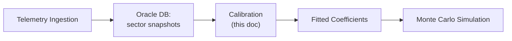
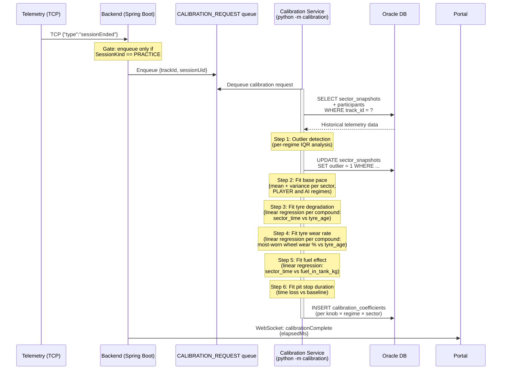
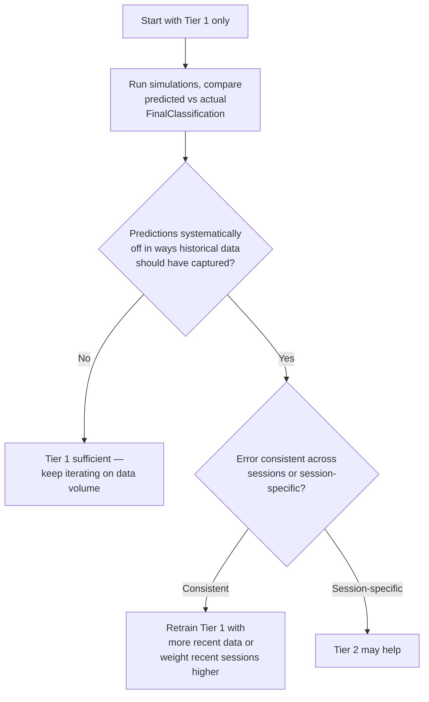
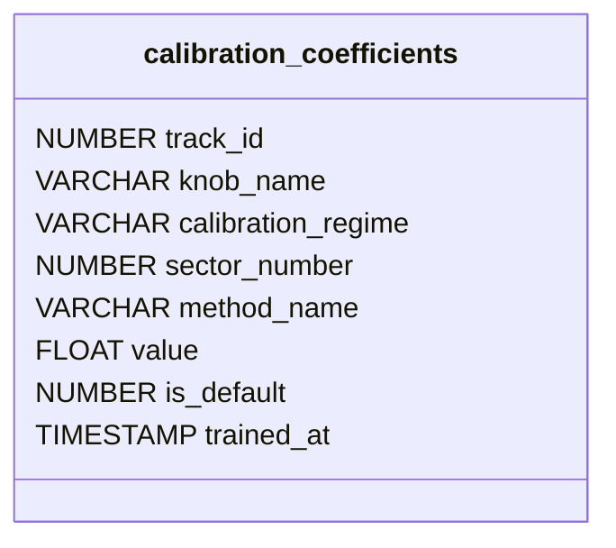

# Model Calibration — Fitting the Simulation to the Game

## Relationship to Monte Carlo

Monte Carlo simulation is **dumb sampling** — it draws from whatever distributions and coefficients you give it. It does not learn, adjust, or self-correct. The quality of the simulation depends entirely on the quality of its input model.

This document describes the **calibration layer** that sits between raw telemetry data (captured by the ingestion pipeline — see `03-MONTECARLO.md`) and the Monte Carlo simulation engine. Calibration transforms accumulated historical data into fitted model coefficients ("knobs") that the simulation uses to predict sector times.



> **Implementation status (PoC).** The pipeline fits a reduced subset of the full lap-time model described in this chapter: a per-car **pace baseline**, **tyre degradation** (per compound, per sector), **tyre wear rate** (per compound, sector-wide — feeds the simulator's stint cap), **fuel effect**, and **pit stop duration** — each fitted separately for PLAYER and AI. The remaining knobs catalogued below are **not fitted by calibration**: **car damage** is now applied by the simulator as a **hardcoded** penalty (with front-wing repair stops — see Knob 4), while dirty air, DRS, weather and temperature, tyre temperature, overtake probability, and event probabilities remain **design roadmap**. The additive model and full knob catalogue describe where the system is headed; the [implemented fitting steps](#implementation-standalone-python-service) are at the end of this chapter.

### Use Case: Calibration Pipeline



Without calibration, the simulation would need hardcoded guesses (e.g. "front wing damage costs 0.5–3 seconds") with wide, uninformed distributions. With calibration, each effect is a fitted function derived from observed data, and the Monte Carlo sampling is limited to genuinely uncertain events (safety cars, overtake success, mechanical failures).

## Dual Calibration: AI Cars vs Player Car

F1 25 runs **different physics models** for AI-controlled cars and the player car. Community testing and EA forum reports strongly suggest that AI cars use a simplified, pre-programmed pace reduction to simulate tyre wear, rather than the full tyre physics model applied to the player. AI cars also appear to handle ERS, tyre temperatures, and traction differently.

This means a single unified calibration model fitted to all 20 cars will produce coefficients that describe **neither** system accurately. The calibration pipeline must maintain **two separate sets of coefficients**:

- **Player coefficients** — fitted from the player car's telemetry only. These reflect the game's full physics simulation (tyre wear, temperature, fuel, damage, etc.)
- **AI coefficients** — fitted from the 19 AI cars' telemetry. These reflect the game's simplified AI pace model

### How to Separate the Data

The `Participants` packet includes an `aiControlled` field (1 = AI, 0 = human). The ingestion pipeline should store this flag per participant per session. When querying `sector_snapshots` for calibration:

- Filter by `aiControlled = 0` for player coefficients
- Filter by `aiControlled = 1` for AI coefficients

### Implications for the Simulation

When the Monte Carlo simulation predicts a race outcome, it must use:

- Player coefficients for the player's car
- AI coefficients for all AI opponents

This is critical — using player-fitted tyre degradation curves for AI cars will overestimate their pace drop-off, leading to overly optimistic strategy predictions.

### Data Volume Tradeoff

Splitting the dataset has a cost: player coefficients are fitted from **1 car** per session instead of 20. This means:

- AI coefficients accumulate data 19x faster
- Player coefficients need many more sessions to reach statistical significance
- Some player knobs (damage effects, weather) may never have enough data and will rely on defaults longer

## The Lap Time Model

The simulation predicts sector times using an additive model:

```
sector_time = base_pace
            + tyre_degradation(compound, tyre_age, tyre_wear)
            + fuel_effect(fuel_load)
            + damage_effect(wing_damage, floor_damage, engine_damage, ...)
            + dirty_air_effect(gap_to_car_ahead)
            + drs_effect(drs_allowed, track, sector)
            + weather_effect(weather, track_temp, air_temp)
            + tyre_temp_effect(surface_temp, inner_temp)
            + residual_noise
```

Each term is a function with coefficients — those coefficients are the **knobs**. Calibration fits these knobs from historical data. The `residual_noise` term captures variance the model can't explain — this is what Monte Carlo actually samples from.

> **What the PoC actually fits.** Of the terms above, only base pace, tyre degradation, and fuel effect are fitted today. The simulator evaluates `sector_time = pace_baseline / 3 + tyre_degradation + fuel_effect + damage + residual_noise`, where `residual_noise ~ Gaussian(0, 150 ms)` and `damage` is a **hardcoded** per-component penalty (not calibrated — see Knob 4). The dirty-air, DRS, weather, and tyre-temperature terms remain part of the designed model but are neither calibrated nor used by the engine.

**Additive vs multiplicative model:** The additive form is a simplification. In real physics (and likely in the game), aero effects like damage and dirty air apply as percentage-based downforce reductions, which would be better modeled multiplicatively. The additive model is the starting point — if residual analysis shows systematic patterns (e.g., damage effects scaling with base pace), switch to a log-linear or multiplicative form. See `09-CHALLENGES.md` (Challenge 1) for details.

## Empirical Fitting: Game Physics vs Real-World Assumptions

F1 25 is a game, not reality. Every coefficient must come from observed game telemetry, not from real-world F1 data or intuition. The game's internal formulas are a black box — calibration treats them as such.

It's tempting to use real F1 knowledge to parameterize the simulation. "Dirty air costs about 0.3 seconds per sector within 1.5 seconds of the car ahead." "DRS gives roughly 0.5-0.8 seconds on a long straight." "Floor damage is catastrophic for ground-effect cars." These statements are true for real Formula 1 — they are **not necessarily true for F1 2025 the video game**.

The game's physics engine must run in real-time on consumer hardware, feel fun and balanced, and work consistently across 20+ tracks. Its dirty air model, DRS effect, tyre degradation curves, fuel consumption, and damage impacts are all **approximations with unknown parameters** that may loosely correlate with reality or diverge significantly.

### What Must Be Fitted Empirically

| Effect               | Real F1 Knowledge                                               | Game Reality                                                                       | Fitting Approach                                                                                                                            |
| -------------------- | --------------------------------------------------------------- | ---------------------------------------------------------------------------------- | ------------------------------------------------------------------------------------------------------------------------------------------- |
| **Dirty air**        | ~35-50% downforce loss within 1 car length, reduced post-2022   | Unknown thresholds, magnitude, and track variation                                 | Compare sector times at different `deltaToCarInFront` vs clean-air baseline. Start with piecewise model: linear below threshold, zero above |
| **DRS advantage**    | Near zero (Monaco) to ~0.8s (Monza), depends on straight length | Exists but exact gain per sector per track unknown                                 | Compare `drsAllowed=1` vs `drsAllowed=0` for same driver/conditions. Clean binary comparison                                                |
| **Tyre temperature** | Narrow optimal window (~10-15°C), grip drops outside            | Temperature reported but unclear if game models grip as f(temp) or just decorative | Fit quadratic model (optimal window with drop-off). Drop knob if no sensitivity found                                                       |

Assumptions from real F1 knowledge are starting hypotheses to test, not facts to encode. If residual analysis shows the game behaves differently from expectations, trust the data.

## Working Assumption: Structured Game Physics

F1 25 is a game, not reality. The game engine applies internal formulas to compute physics effects. Within each physics regime (player vs AI):

- A given damage level at a given speed likely produces a consistent aero penalty
- Fuel consumption follows a fixed burn rate
- Tyre degradation follows a curve (though the curve differs between player and AI)

The apparent variance in observed effects (e.g. "wing damage seems to cost anywhere from 0.5 to 3 seconds") comes from **confounding variables** (damage level, compound, fuel load, track sector), not randomness in the game's formula.

**This is a hypothesis, not a proven fact.** The calibration pipeline should validate it: if residuals remain large and unstructured after fitting all knobs, the game may introduce stochastic elements not captured by the model. See `09-CHALLENGES.md` (Challenge 6) for validation approaches.

## Required Game Settings

Calibration assumes consistent game settings across all sessions used for fitting. The following settings affect game physics and **must be recorded** alongside session data:

| Setting              | Why It Matters                                        |
| -------------------- | ----------------------------------------------------- |
| AI Difficulty        | Changes AI pace directly                              |
| Damage Simulation    | Full / Reduced / Visual Only — changes damage physics |
| Tyre Wear Simulation | Changes degradation rates                             |
| Fuel Consumption     | Changes fuel burn rate                                |
| Weather              | Dynamic vs fixed affects available data               |

If settings vary between sessions, coefficients fitted from mixed data will be unreliable. For the POC, consistent settings are enforced across all calibration sessions. The alternative — conditioning coefficients on settings (fitting separate coefficients per difficulty level, damage mode, etc.) — would multiply data requirements beyond what a POC can accumulate.

The `Session` packet includes `aiDifficulty`. Other settings may need to be recorded manually or extracted from the game's configuration.

## Knobs: What to Calibrate

Each knob below is fitted **twice** — once for player data, once for AI data — unless noted otherwise.

> **Status.** Knobs **1** (base pace), **2** (tyre degradation), **3** (fuel effect), and **3a** (tyre wear rate) are implemented, plus **pit stop duration** (covered under [Implementation](#implementation-standalone-python-service), not listed as a separate knob below). Knobs **4–10** are documented as the design roadmap but are **not yet fitted** — each is tagged below.

### 1. Base Pace (per driver/team, per track, per sector)

The intrinsic speed of each car on clean air, fresh tyres, full fuel, no damage. This is the intercept of the model.

- **Fit from:** Sector times on valid laps with clean air (large `deltaToCarInFront`), low tyre age, controlled fuel load
- **Form:** Mean + variance per driver per sector per track
- **Grouping:** By team (both drivers in a team share car performance) with a per-driver offset
- **AI note:** AI base pace is strongly influenced by the AI difficulty setting. Coefficients must be conditioned on difficulty level

### 2. Tyre Degradation (per compound, per track)

How sector time increases as tyres age and wear.

- **Fit from:** Sector time vs `tyresAgeLaps` and `tyresWear`, grouped by `actualTyreCompound` and track
- **Form:** Polynomial or piecewise linear. Typically near-linear early, then a "cliff" at high age
- **Key variables to control for:** Fuel load (decreases over stint — see multicollinearity note below), dirty air (increases apparent deg), damage
- **Output:** Coefficients like `deg_rate_per_lap` and `cliff_onset_lap` per compound per track
- **AI note:** AI tyre deg is reportedly pre-programmed rather than physics-simulated. AI coefficients may show a simpler, more linear pattern than player coefficients

#### Multicollinearity: Fuel vs Tyre Age

Within a single stint, `fuelInTank` and `tyresAgeLaps` are almost perfectly linearly correlated — both change by a near-constant amount per lap. A multivariate regression on within-stint data **cannot reliably separate** the fuel effect from tyre degradation. The regression will still converge, but the individual coefficients will be unstable — small changes in the data cause large swings in the estimated values, even though their combined effect is well-estimated.

**Why this matters for strategy:** The simulation uses tyre degradation coefficients to evaluate pit stop timing ("pit now or push 5 more laps?"). If the tyre deg curve includes hidden fuel effects, the model thinks old tyres are slower than they actually are — because it attributes fuel-related slowness to tyre age — making strategy predictions unreliable.

**As built: direct regression, fuel not subtracted, with a plausibility clamp.** The implemented `_fit_tyre_degradation` (`pipeline.py`) does a **plain linear regression** of `sector_time_ms` against `tyre_age_laps`, grouped by compound and sector — with **no fuel pre-correction**. Fuel is fitted separately as its own knob (Knob 3, `_fit_fuel_effect`), but that fuel coefficient is **not** used to pre-correct the degradation data. As a consequence the fitted deg slope **conflates** the (small) fuel-burn change over a stint with the genuine tyre-age effect — on thin/early FP data this confounding can even produce a **negative or absurdly large** slope (a few noisy laps once fit ~1500 ms/lap ≈ 4.5 s/lap, which made the simulator pit far too early). To stop that poisoning the simulator, the fitted slope is **clamped** to a plausible range (`0 ≤ slope ≤ MAX_TYRE_DEG_MS_PER_LAP = 300` ms/lap/sector) and **falls back to the cold-start prior** when outside it; fuel is clamped the same way (`0 ≤ slope ≤ 50` ms/kg). On sparse data this means deg/fuel often default to the prior rather than a fitted value. This is a **known PoC limitation** — cleanly separating fuel from deg needs a joint (multiple) regression. Coefficients are stored in **milliseconds**, matching the engine, which adds them straight onto ms sector times.

**Considered refinement (roadmap, not applied): fuel burn rate subtraction.** Measure the fuel consumption rate from `fuelInTank` deltas between consecutive laps. Since F1 25 appears to enforce a near-constant burn rate, the estimated fuel effect could be subtracted analytically before fitting tyre degradation on the residual — a two-stage process: (1) measure burn rate, (2) compute expected fuel penalty per lap, (3) subtract from sector times, (4) fit tyre deg on the residual. This would require the least data and can be applied within individual stints, but it is **not currently implemented**.

Two further alternatives were considered. **Cross-stint comparison** — comparing sector times at the same tyre age but different fuel loads across stints — isolates the variables cleanly but requires enough sessions with varied pit strategies to have comparable data points; it serves as a validation method once data accumulates. **Pit stop resets** — comparing pre/post pit sector times where tyre age resets to 0 but fuel stays constant (no refueling in F1 25) — also isolates the factors but depends on having enough pit stop events with similar conditions.

### 3. Fuel Effect (per track)

How carrying more fuel slows the car.

- **Fit from:** Sector time vs `fuelInTank`, using cross-stint comparisons to avoid multicollinearity with tyre age
- **Form:** Linear. Real F1 is ~0.03–0.04s/kg/lap ([Wright, 2001](10-REFERENCES.md#wright2001)); the game may use a similar constant per track, but this must be verified empirically
- **Output:** `fuel_penalty_per_kg` per sector per track

### 3a. Tyre Wear Rate (per compound)

How fast the tyre physically wears, in **wear-% per lap** — distinct from tyre degradation (Knob 2), which measures the resulting time loss. This knob does not enter the additive lap-time model; it feeds the simulator's stint-length cap.

- **Fit from:** `_fit_tyre_wear_rate` (`pipeline.py`) regresses the **most-worn wheel's** wear % (max of the four per-wheel values) against `tyre_age`, grouped by compound and regime
- **Gate:** `MIN_WEAR_SAMPLES = 5` — lower than the time-slope's 10, because wear is smooth and monotonic, so it calibrates from few laps
- **Form:** Linear regression, slope clamped to ≥ 0 (wear can't fall with age); a 0 slope makes the simulator fall back to the hardcoded lifespan
- **Output:** `tyre_wear_rate_{soft,medium,hard}`, stored **sector-wide** (no per-sector value)
- **Used by:** the simulator's wear-cliff stint cap (`simulator/tyre_lifespan.py`): `laps_to_cliff = cliffPct / wear_rate`, where `cliffPct` is hardcoded at 40% (`CLIFF_WEAR_PCT`)

### 4. Car Damage Effects _(hardcoded in the simulator — not calibrated)_

> **As built:** calibration does **not** fit damage (the data is too sparse). Instead the simulator (`simulator/engine.py`) applies a **hardcoded** per-component penalty: `loss_per_lap = scale × (50·d + 0.1·d²)` for `d` = damage %, with `scale` 1.0 / 0.8 / 0.5 for front wing / floor / engine (≈ 6.0 / 4.8 / 3.0 s/lap at 100%), split evenly across the three sectors and stacked. A pit stop can **repair the front wing** (resets it, +10 s), the strategy generator proposes repair stops once front-wing damage ≥ 20%, and engine damage raises the per-sector DNF rate (up to 4× at 100%). Calibrating damage from telemetry is **not pursued** — damage events are too sparse to fit reliably, and the hardcoded model is sufficient for the PoC. The table below records that considered-but-rejected fitting approach for reference.

How each damage type affects pace. Multiple sub-knobs:

| Damage Component | Expected Effect                                                                    | Fit From                                                      |
| ---------------- | ---------------------------------------------------------------------------------- | ------------------------------------------------------------- |
| Front wing (L/R) | Aero loss, primarily in high-speed corners                                         | Sector time vs `frontLeftWingDamage` / `frontRightWingDamage` |
| Rear wing        | Aero + DRS loss                                                                    | Sector time vs `rearWingDamage`                               |
| Floor            | Major downforce loss (ground effect) ([Mendez, 2023](10-REFERENCES.md#mendez2023)) | Sector time vs `floorDamage`                                  |
| Diffuser         | Rear downforce loss                                                                | Sector time vs `diffuserDamage`                               |
| Sidepod          | Cooling + aero                                                                     | Sector time vs `sidepodDamage`                                |
| Engine           | Straight-line speed loss                                                           | Sector time vs `engineDamage`                                 |
| Gearbox          | Reliability risk (not direct pace)                                                 | Retirement probability vs `gearBoxDamage`                     |

- **Form:** Linear or piecewise linear per damage component. If the game applies percentage-based aero/power reduction, a multiplicative model may fit better (see additive vs multiplicative note above)
- **Challenge:** Damage events are sparse — most sector snapshots have zero damage. Needs multiple sessions with collisions/incidents to build enough data points
- **Output:** `time_loss_per_percent_damage` per component per sector type (high-speed vs low-speed sectors)

### 5. Dirty Air Effect _(design roadmap — not yet fitted)_

Time lost when following another car closely.

- **Fit from:** Compare sector times at different `deltaToCarInFront` values vs clean-air baseline (large gap), controlling for driver, compound, tyre age, fuel
- **Form:** Decay function — effect strongest under ~1.5s gap, diminishing with distance, negligible beyond ~3s. The actual thresholds in the game are unknown and must be fitted from data
- **Output:** `dirty_air_time_loss(gap)` function per track
- **Note:** The game's dirty air model may not match real F1 physics ([Noble & Straw, 2025](10-REFERENCES.md#therace-dirtyair)). Do not assume real-world aero knowledge transfers to the game — fit from observed data only

### 6. DRS Advantage (per track, per sector) _(design roadmap — not yet fitted)_

Time gained when DRS is active.

- **Fit from:** Sector time difference when `drsAllowed=1` vs `drsAllowed=0`, same driver, same conditions
- **Form:** Constant per sector (DRS advantage is fixed by straight length). Near zero in sectors without DRS zones
- **Output:** `drs_advantage_seconds` per sector per track

### Defending: Not Modeled Explicitly

A car defending position uses more fuel, takes sub-optimal lines, and wears tyres more. This is partially captured implicitly through dirty air and gap data. For the POC, defending is skipped as an explicit variable — its effects are likely small compared to tyre degradation, fuel, and dirty air. The defending-induced slowness is absorbed into `residual_noise`, which Monte Carlo samples from — so it contributes to variance rather than being silently dropped. The gap-to-car-behind is derivable from the following car's `deltaToCarInFront` (a self-join on `sector_snapshots`), so no additional telemetry capture is needed if this is revisited.

The alternatives were to ignore defending explicitly and treat dirty air as a sufficient proxy — reasonable but the leading car's extra tyre wear shows up as unexplained residuals — or to model it as a modifier by adding a "being followed closely" variable, which is tricky because defending and "being slow" are indistinguishable in sector time data without driver input signals (steering angles, racing line deviation) that are not captured. Revisit if residual analysis after initial calibration shows systematic patterns (e.g., consistently large positive residuals) for cars with a close follower.

### 7. Weather and Temperature Effects _(design roadmap — not yet fitted)_

How conditions affect pace.

- **Fit from:** Sector time deltas when `weather`, `trackTemperature`, or `airTemperature` change mid-session
- **Form:** Categorical for weather type (dry/light rain/heavy rain), linear for temperature
- **Challenge:** Weather variation is rare in game sessions unless specifically configured. May need many sessions
- **Output:** `weather_pace_modifier` per weather type, `temp_pace_coefficient` per degree

### 8. Tyre Temperature Effect _(design roadmap — not yet fitted)_

How tyre temps outside the optimal window affect grip.

- **Fit from:** Sector time vs `tyresSurfaceTemperature` and `tyresInnerTemperature`, controlling for compound and age
- **Form:** Quadratic (optimal window with performance drop-off on both sides)
- **Output:** `optimal_temp_range` and `temp_sensitivity_coefficient` per compound
- **AI note:** AI cars may not be subject to the same tyre temperature effects. If AI coefficients show no temperature sensitivity, this knob can be dropped from the AI model

### 9. Overtake Probability (per track, per sector) _(design roadmap — not yet fitted)_

Probability that a faster car passes a slower one at a sector boundary.

- **Fit from:** Historical position changes at sector boundaries, correlated with pace delta, gap size, DRS status, tyre compound difference
- **Filtering:** Exclude position changes caused by pit stops — both cars must have `pitStatus = 0` in both the before and after snapshots. Only count changes where the gap between the two cars was below a threshold (e.g., < 3s) to exclude lapping
- **Filtering pit-cycle position changes:** Position changes at sector boundaries can be caused by pit stop cycles, not on-track overtakes. To avoid contaminating the model:
  - Both cars must have `pitStatus = 0` at both the sector before and the sector after the position change
  - The gap between the two cars must be below a threshold (e.g., < 3s) — positions gained due to lapping are not overtakes
  - Exclude laps where any car in the relevant positions entered or exited the pit lane
  - **Edge cases:** Undercuts (car pits, comes out ahead) are strategy-driven, not on-track overtakes. DRS trains have different dynamics. For the POC, start with simple gap + pit status filtering and revisit if overtake probability predictions are poor
- **Form:** Logistic regression ([Hosmer et al., 2013](10-REFERENCES.md#hosmer2013)) — probability as a function of multiple input variables
- **Output:** Logistic model coefficients per sector per track

### 10. Event Probabilities _(design roadmap — not yet fitted)_

Probability of discrete disruptive events per unit of race distance.

| Event          | Fit From                                    | Form                                                                                         |
| -------------- | ------------------------------------------- | -------------------------------------------------------------------------------------------- |
| Safety car     | `SCAR` event frequency per race             | Poisson rate per lap (initial estimate ~0.01/lap, varies heavily by track and game settings) |
| Red flag       | `RDFL` event frequency                      | Poisson rate per race                                                                        |
| Mechanical DNF | `RTMT` events correlated with damage levels | Logistic (damage level, remaining laps)                                                      |
| Collision      | `COLL` event frequency per sector           | Poisson rate per sector (higher in sector 1 lap 1)                                           |

**Note:** Event rates in the game depend heavily on AI difficulty and damage settings. A single Poisson rate per event type is insufficient — rates should be conditioned on game settings at minimum.

## Calibration Tiers

### Tier 1: Historical Baseline (offline, batch)

The primary calibration approach. After each completed **Free Practice** session, recompute all knob coefficients from the full accumulated dataset, **separately for player and AI**.

- **When:** After a **Free Practice** session ends. `SessionStateHolder.onSessionEnded` (backend) gates the `CALIBRATION_REQUEST` enqueue to `SessionKind.PRACTICE` — other session kinds end without triggering calibration. Rationale: Qualifying pace is push-mode ERS on low fuel, and race pace is contaminated by traffic, dirty air, and fuel saving — neither is a clean baseline for fitting, whereas Free Practice runs representative long stints
- **How:** Query all sector_snapshots from Oracle, split by `aiControlled`, run regression/curve-fitting per knob per regime, store resulting coefficients
- **Storage:** A coefficients table, keyed by `(track_id, knob_name, calibration_regime)` where `calibration_regime` is `PLAYER` or `AI`, with fitted values and confidence intervals
- **Minimum data:** Each knob needs a minimum number of data points before its fitted value is trusted. Below that threshold, fall back to reasonable defaults (see Initial Values below). See Initial Values section below for sample size estimates

This is the recommended starting point. It covers the vast majority of calibration needs and is simple to implement.

### Tier 2: In-Session Dynamic Adjustment (online, future)

Adjusts knob values during a live race based on observed sector times from the current session. Conceptually a Bayesian update: the historical baseline is the prior, and current-session observations shift the estimate.

- **When:** After each completed lap (or sector, if fast enough), update coefficients that have enough new observations
- **Why:** The game may behave differently across patches/updates, or a specific session may have unusual conditions not well-represented in historical data
- **How:** Weighted combination of historical coefficient and current-session estimate, where the weight shifts toward current data as more laps are observed
- **Which knobs benefit most:**
  - **Base pace** — a driver may be faster/slower than historical average due to setup or AI difficulty changes. A few laps of current data can shift the estimate significantly
  - **Tyre degradation** — the current stint's actual deg rate may differ from historical average. Observable after ~5 laps of a stint
  - **Fuel effect** — less useful dynamically (fuel burn rate is near-constant)

- **Risk:** Overfitting to noise in a small sample. A car might have a slow sector 1 due to traffic, not because their base pace changed. Dynamic adjustment must be conservative
- **Implementation:** Not recommended for the initial POC. Add only if Tier 1 validation (predicted vs actual results from FinalClassification) shows systematic errors that a static model can't capture

### Choosing Between Tiers



## Initial Values (Cold Start)

Before enough data is accumulated, the simulation needs reasonable defaults. These are starting guesses, **not** derived from real F1 physics — the game is under no obligation to match reality. They are replaced by fitted values as data accumulates.

Two sets of defaults are maintained — one for player, one for AI. Initially identical, they diverge as data reveals differences.

| Knob                    | Initial Default            | Confidence | Notes                                   |
| ----------------------- | -------------------------- | ---------- | --------------------------------------- |
| Tyre deg (soft)         | 50 ms/lap/sector (0.05 s)  | Low        | Highly track-dependent; AI likely lower |
| Tyre deg (medium)       | 30 ms/lap/sector (0.03 s)  | Low        | Highly track-dependent; AI likely lower |
| Tyre deg (hard)         | 20 ms/lap/sector (0.02 s)  | Low        | Highly track-dependent; AI likely lower |
| Fuel effect             | 10 ms/kg/sector (0.01 s)   | Medium     | May be similar for player and AI        |
| Pit stop time loss      | 22 000 ms                  | Low        | Mean pit-lane time loss per stop        |
| Tyre wear rate (soft)   | 1.33 %/lap                 | Low        | Laps-to-cliff at 40% ≈ old S30 lifespan |
| Tyre wear rate (medium) | 1.08 %/lap                 | Low        | Laps-to-cliff at 40% ≈ old M37 lifespan |
| Tyre wear rate (hard)   | 0.89 %/lap                 | Low        | Laps-to-cliff at 40% ≈ old H45 lifespan |
| Front wing damage       | +0.02s/percent/sector      | Low        | _Superseded — hardcoded in `engine.py`_ |
| Floor damage            | +0.04s/percent/sector      | Low        | _Superseded — hardcoded in `engine.py`_ |
| Engine damage           | +0.01s/percent/sector      | Low        | _Superseded — hardcoded in `engine.py`_ |
| Dirty air (< 1s gap)    | +0.3s/sector               | Low        | _Design only — not yet fitted_          |
| DRS advantage           | -0.2s/sector (DRS sectors) | Medium     | _Design only — not yet fitted_          |
| Overtake probability    | 0.15 per sector boundary   | Low        | _Design only — not yet fitted_          |
| Safety car rate         | 0.01 per lap               | Low        | _Design only — not yet fitted_          |

The implemented cold-start defaults (`calibration/cold_start.py`) cover the first eight rows — the three tyre-degradation compounds, fuel effect, pit stop time loss, and the three tyre wear-rate compounds. The wear-rate defaults (1.33 / 1.08 / 0.89 %/lap for soft/medium/hard) are chosen so that laps-to-cliff at 40% ≈ the old hardcoded lifespans (S30 / M37 / H45). The three **damage** rows are superseded by the simulator's hardcoded damage model (`simulator/engine.py`), not produced by calibration. The remaining rows are placeholders for design-roadmap knobs that have no value yet.

These defaults should be stored alongside fitted values, with a flag indicating whether the knob is using the default or a fitted value. The simulation can weight its confidence accordingly — wider variance when using defaults, tighter when using fitted values with sufficient data.

### Sample Size Estimates per Knob

The parameter space is large (10+ knobs, 20+ tracks, 3 compounds, player/AI split). Rough estimates for when fitted values become trustworthy:

| Knob                  | Sessions per track needed | Notes                                                          |
| --------------------- | ------------------------- | -------------------------------------------------------------- |
| Base pace             | ~3-5                      | Many data points per session (3 sectors × ~50 laps)            |
| Tyre deg per compound | ~5-10 per compound        | Need enough stints on each compound                            |
| Fuel effect           | ~5                        | Can use cross-stint data                                       |
| Dirty air             | ~5-10                     | Many data points per session from AI cars following each other |
| DRS                   | ~3-5                      | Straightforward matched comparison                             |
| Weather               | ~50+                      | Weather variation is rare unless configured                    |
| Overtake probability  | ~10-20                    | Need enough position changes                                   |

**Player coefficients are the bottleneck** — only 1 car per session contributes data. AI coefficients accumulate 19× faster.

**For the POC:** Start with the most data-rich knobs (base pace, AI tyre deg, fuel effect) and leave sparse knobs (weather) on defaults. Track data accumulation per knob and surface a "calibration readiness" indicator per knob.

## Fitting Methodology

### Data Filtering

Before fitting any knob, filter the sector_snapshots dataset:

- **Split by `aiControlled`** — always fit player and AI coefficients separately
- **Exclude invalid laps** — `currentLapInvalid = 1` or `cornerCuttingWarnings > 0`
- **Exclude in/out laps** — `pitStatus != 0` (pit lane distorts sector times)
- **Exclude safety car laps** — `safetyCarStatus != 0` (artificially slow)
- **Exclude the standing-start sector (races only)** — `NOT (lap_number = 1 AND sector_number = 0 AND session_type IN (10, 11, 12, 15, 16, 17))`. Only races drop lap 1 / sector 0 (the standing start, cold tyres, first-corner contact). Launch sessions (FP, Qualifying) keep that sector because the car is released onto an out-lap and crosses the line already warmed up
- **Filter by game settings** — only include sessions with matching AI difficulty, damage mode, tyre wear mode

### Outlier Detection (Per-Regime IQR) ([Tukey, 1977](10-REFERENCES.md#tukey1977))

After applying the hard filters above, the dataset still contains **performance anomalies** — sectors that are technically valid but statistically unusual. A driver locking up into turn 1, getting punted, or encountering unexpected traffic can produce sector times that don't trigger `currentLapInvalid` but would distort calibration coefficients if included.

These anomalous sectors must be **marked, not deleted**. They're excluded from calibration (`WHERE outlier = 0`) but remain visible in driver feedback views — a 1.8s loss in sector 2 on lap 14 is valuable feedback even if it shouldn't train the model.

#### Why Per-Regime, Not Per-Driver or Global

Outlier detection must group by the **same population that fitting uses**. Fitting pools all AI cars into one AI regime (and the player into a PLAYER regime), so the IQR must be computed over that same regime. An earlier version grouped per `driver_name`, but that split the AI field into ~19 tiny groups that rarely reached `MIN_SAMPLES_FOR_IQR` (10) — so AI outliers were almost never flagged. PLAYER is a single human driver, so it is one group either way and is unaffected.

A global IQR across both regimes would be wrong for the opposite reason: AI and player physics differ, so a sector that is normal for one regime can look anomalous against the other. Grouping by regime keeps the AI/HUMAN IQR multipliers (1.5 / 2.0 — see below) meaningful per regime.

#### Grouping Key

`(regime, track_id, sector_number, tyre_compound_visual, weather_category)`

`regime` is `PLAYER` or `AI` (derived from `ai_controlled`). Grouping by compound is essential — a sector on worn softs vs fresh hards would inflate the IQR and mask real outliers. `weather_category` is `dry` or `wet`, derived from the F1 2025 weather codes (0–5) captured on each snapshot — wet and dry baselines differ by several seconds per sector, so mixing them would inflate the IQR fences and mask genuine outliers. Tyre age and fuel load are **not** part of the grouping key because they are continuous variables that would fragment the data into too-small groups. The calibration regression handles those factors separately.

#### Algorithm

The outlier detection runs as **Step 0 of Tier 1 batch calibration**, after hard filters but before any knob fitting. It is recomputed each calibration run — the `outlier` column is overwritten, not append-only. As more data accumulates, the IQR boundaries refine.

1. **Group** the hard-filtered working set by `(regime, track_id, sector_number, tyre_compound_visual, weather_category)`
2. **Check sample size** per group:
   - N ≥ 10 → IQR path (step 3)
   - N < 10 → skipped (no outlier flagging — without enough samples there is no reliable basis to judge an outlier)
3. **IQR computation** (sufficient data):
   - Compute Q1 (25th percentile) and Q3 (75th percentile) of `sector_time_ms`
   - IQR = Q3 − Q1
   - If IQR = 0 (all identical times), skip — no outliers to detect
   - Multiplier: **1.5** for AI drivers (`ai_controlled = 1`), **2.0** for human drivers (humans are more variable lap-to-lap)
   - Lower fence = Q1 − multiplier × IQR
   - Upper fence = Q3 + multiplier × IQR
   - Flag `outlier = 1` for any `sector_time_ms` outside [lower fence, upper fence]
4. **Batch UPDATE** — idempotent update of `sector_snapshots.outlier` for all rows in the working set

#### AI vs Player Thresholds

AI cars use a simplified physics model and are highly deterministic — their sector times for identical conditions are nearly identical. A 1.5× IQR multiplier (standard Tukey fence) is appropriate.

Human players are inherently more variable. A 2.0× multiplier avoids false positives from normal lap-to-lap variation while still catching genuine mistakes. Both multipliers are hardcoded for the POC.

#### Minimum Sample Size

IQR requires **N ≥ 10** sectors per group before it is computed. Below ~8–10 data points, Q1 and Q3 estimates become unstable. Groups below the threshold are left unflagged. The threshold of 10 is a pragmatic minimum for the POC.

### Variable Isolation

The main challenge is that all variables change simultaneously. A car on lap 20 has older tyres AND less fuel AND possibly more damage than on lap 5. Naive fitting will confound these effects.

Approaches:

1. **Multivariate regression** — fit all knobs simultaneously in a single regression. Each coefficient isolates one effect while controlling for the others. **Caveat:** fuel load and tyre age are highly correlated within stints (see multicollinearity note under Knob 2). Use cross-stint data or pre-compute fuel corrections before applying regression
2. **Matched comparisons** — for specific knobs (e.g. DRS), find pairs of sectors from the same driver where only the variable of interest differs. More robust but requires careful pair selection
3. **Stint-based analysis** — for tyre deg, isolate single stints (between pit stops) where compound and damage are constant, and fit deg as a function of tyre age within each stint. Subtract estimated fuel effect first using the known burn rate

### Validation

After fitting, validate each knob by checking if the model can predict sector times on held-out data:

1. **Train/test split** — fit on 80% of sessions, validate on 20%
2. **Residual analysis** — are residuals normally distributed with small variance? Large residuals suggest a missing variable or a non-linear effect the model isn't capturing. Systematic patterns in residuals (e.g., residuals scaling with base pace) suggest the additive model is wrong
3. **End-to-end validation** — run the full Monte Carlo simulation on historical races and compare predicted positions/times against FinalClassification ground truth (see `03-MONTECARLO.md` — Simulation Validation)

## Coefficient Storage

Fitted coefficients need to be stored and versioned so the simulation always uses the latest calibration. Suggested structure:



This can be a table in Oracle alongside the telemetry data, or a separate configuration store — the simulation just needs to load the current coefficients for the relevant track and regime before running.

## Implementation: Standalone Python Service

Calibration is implemented as a standalone Python service (`python -m calibration`, no arguments), a long-running worker that consumes `CALIBRATION_REQUEST` messages from Oracle TxEventQ — mirroring the simulator's architecture (see `06-INTEGRATION.md` Flow 4). The backend only enqueues; the service dequeues and processes in-process. A one-off CLI mode (`python -m calibration run <trackId>`) is also available for manual runs. The pipeline reads from and writes to the same Oracle schema used by telemetry and simulation.

### Pipeline Architecture

The pipeline (`calibration/pipeline.py` `run()`) commits in **two stages**, not one atomic transaction:

```
connect → cold-start defaults + outlier flags → COMMIT
        → per-regime fits (deg, wear-rate, fuel, pit) + sector baselines → COMMIT
```

Cold-start defaults and recomputed outlier flags are committed first, so they persist regardless of what follows. The coefficient fits and `sector_pace_baselines` are then written and committed together at the end (the commit lives in `_fit_sector_baselines`), so a failure mid-fit rolls back the uncommitted coefficients and baselines — but **not** the already-committed outlier flags. The fits are therefore not wrapped in a single all-or-nothing transaction.

### Fitting Steps

Each step has a minimum sample threshold — if insufficient data exists, the step is skipped and existing coefficients (or cold-start defaults) remain in place.

| Step | Knob                                        | Min samples | Data filter                                                                                              |
| ---- | ------------------------------------------- | ----------- | -------------------------------------------------------------------------------------------------------- |
| 1    | Base pace (per sector)                      | 5           | "Clean data": tyre age ≤5 laps, gap ahead >2s or leading, no damage                                      |
| 2    | Tyre degradation (per compound, per sector) | 10          | Linear regression: `time_ms = baseline + slope × tyre_age`; slope clamped to [0, 300] ms/lap, else prior |
| 3    | Tyre wear rate (per compound, sector-wide)  | 5           | Linear regression: `most-worn wheel wear % = baseline + slope × tyre_age`, slope clamped ≥ 0             |
| 4    | Fuel effect (per track)                     | 5           | Linear regression: `time_ms = baseline + slope × fuel_kg`; slope clamped to [0, 50] ms/kg, else prior    |
| 5    | Pit stop duration (per regime)              | 3           | Mean/variance of time loss vs baseline sector times                                                      |

All steps filter by `ai_controlled` to produce separate PLAYER and AI coefficients (see Dual Calibration above).

### Pit Stop Grouping

Pit stop duration is derived from sector snapshots by stateful parsing of `pit_status` flags. The pipeline reconstructs individual pit stop events by detecting transitions through pit entry → pit lane → pit exit across consecutive sectors. The time loss is computed as the difference between the in-lap/out-lap sector times and the driver's baseline sector times for the same conditions.
