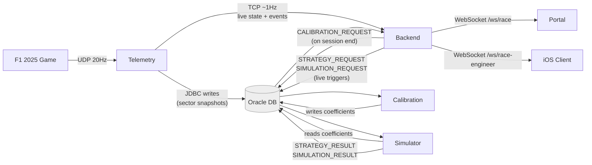
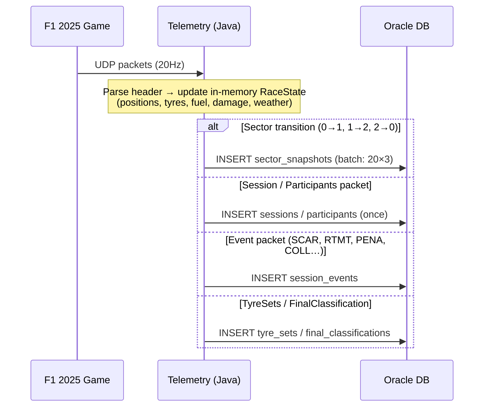
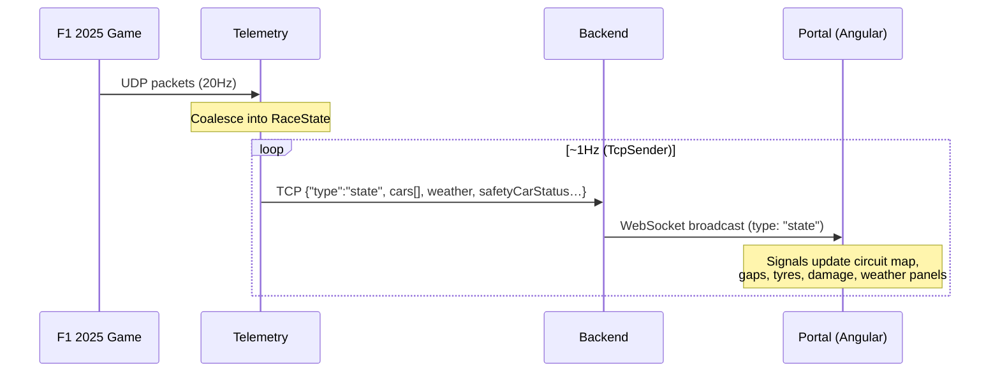
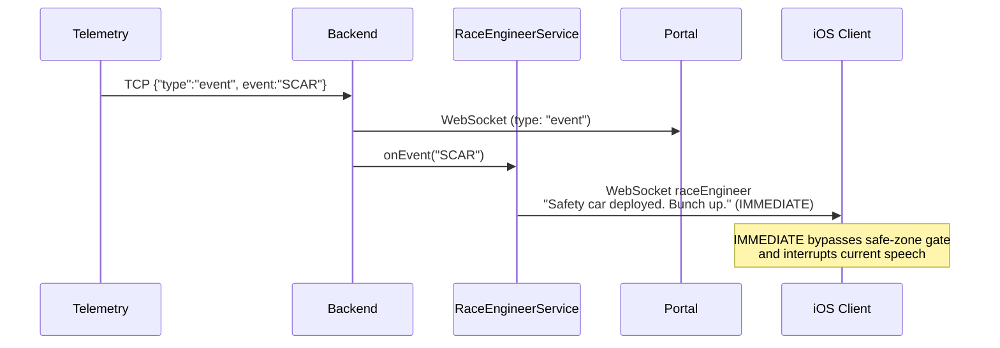
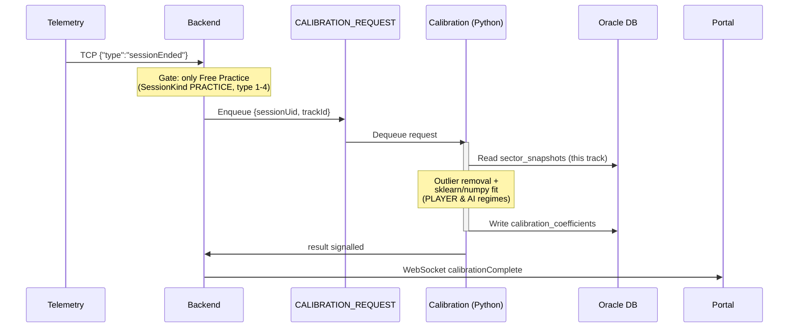
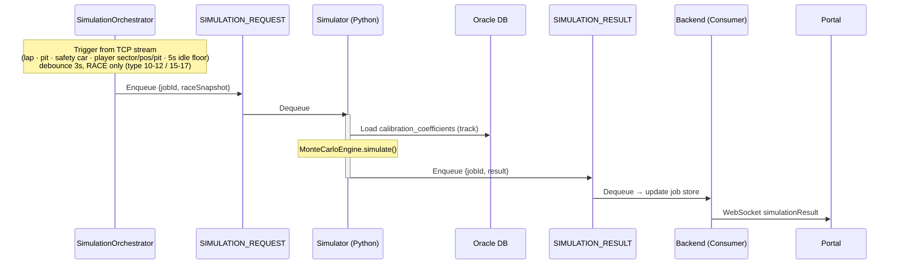
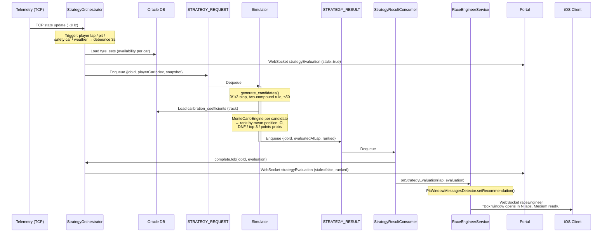
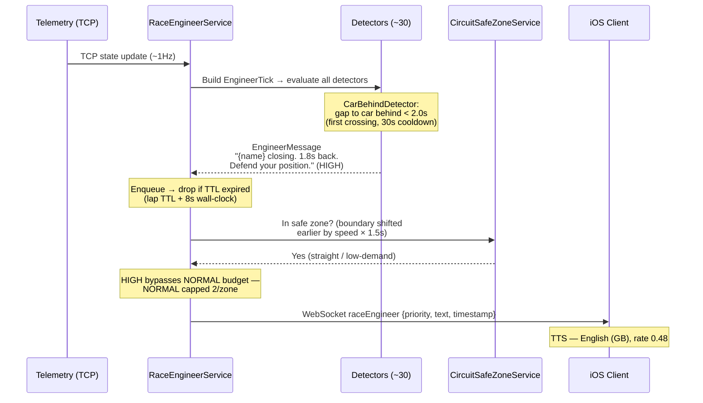
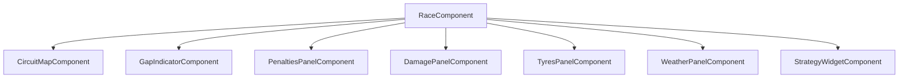
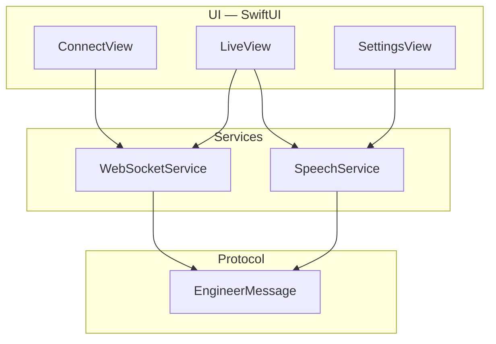

# Integration & End-to-End Data Flows

This chapter traces how data moves through the system **from collection to feature** — from a
UDP packet leaving the game to a radio message spoken on the phone, a dashboard panel updating,
a ranked strategy, or a refitted model. The **end-to-end flows** (§Flows) are the backbone:
each says what kicks off the processing, which queues are involved, and which component hands
data to which. The **reference** sections (§Reference) hold the cross-cutting detail — protocol
table, WebSocket channels, REST API, shared DB, interface versioning, and the TCP-push rationale.

## Actors and transports

| Actor            | Tech             | Role in the flows                                                                   |
| ---------------- | ---------------- | ----------------------------------------------------------------------------------- |
| **F1 2025 Game** | —                | Emits UDP telemetry packets at 20 Hz                                                |
| **Telemetry**    | Plain Java       | Parses UDP, persists to Oracle, pushes live state to Backend over TCP               |
| **Oracle DB**    | Oracle 26ai      | Shared store + TxEventQ message broker for all async work                           |
| **Backend**      | Spring Boot      | REST/WebSocket API; orchestrates calibration, simulation, strategy; generates radio |
| **Calibration**  | Python service   | Fits model coefficients from historical laps (consumes `CALIBRATION_REQUEST`)       |
| **Simulator**    | Python / FastAPI | Runs Monte Carlo race simulations + strategy evaluation (consumes `*_REQUEST`)      |
| **Portal**       | Angular          | Live race dashboard + strategy leaderboard (WebSocket `/ws/race`)                   |
| **iOS Client**   | SwiftUI          | Speaks race engineer messages via TTS (WebSocket `/ws/race-engineer`)               |

**Transports:** UDP (game → telemetry, 20 Hz), JDBC + Oracle UCP ([Oracle Corporation, 2025](10-REFERENCES.md#oracle-ucp))
(telemetry/backend ↔ Oracle), TCP newline-delimited JSON (telemetry → backend, port 9090, ~1 Hz),
WebSocket (backend → portal/iOS), Oracle **TxEventQ** ([Oracle Corporation, 2025](10-REFERENCES.md#oracle-txeventq))
queues (async work between backend and the Python workers).

**Queues (Oracle TxEventQ, `PDBADMIN.*`):** `CALIBRATION_REQUEST`, `SIMULATION_REQUEST`,
`SIMULATION_RESULT`, `STRATEGY_REQUEST`, `STRATEGY_RESULT`, `SESSION_LIFECYCLE` (multi-consumer).

## System overview

Every feature is one path through this graph. The longest is the **"strategy brain"**: prior
sessions feed **calibration** (Flow 4) → fitted coefficients → live **strategy evaluation**
(Flow 6) → ranked strategies → a **radio pit-window message** (Flow 7) and the **portal strategy
widget**.

---

# Flows

## Flow 1 — Ingestion & persistence (the foundation)

The game streams UDP packets; telemetry keeps a 20-car `RaceState` in memory and writes durable
rows to Oracle on meaningful boundaries. Everything else builds on this.

- **Kicked off by:** UDP packets from the game (20 Hz).
- **Queues:** none — direct JDBC write (Oracle thin driver + UCP pool), `config: telemetry/config.properties`.
- **Path:** Game → Telemetry → Oracle.
- **What persists when:** `sessions` / `participants` once per session (packets 1, 4);
  `sector_snapshots` on each sector transition (packet 2, batched via `addBatch()`/`executeBatch()`,
  20 cars × 3 sectors ≈ 60 rows/lap); `session_events` on events (packet 3 — SCAR, RTMT, PENA, COLL…);
  `tyre_sets` at session start and each pit stop (packet 12); `final_classifications` once at session
  end (packet 8). High-frequency telemetry/status/damage packets (6, 7, 10) only update in-memory
  state and are snapshotted on the next sector boundary.

> Table definitions: `04-DATABASE_DESIGN.md`.

## Flow 2 — Live race dashboard (Portal)

The portal renders a live dashboard without ever querying the DB — it consumes the relayed TCP
state stream over WebSocket.

- **Kicked off by:** every TCP state frame telemetry pushes (~1 Hz).
- **Queues:** none — TCP push, then WebSocket broadcast.
- **Path:** Game → Telemetry → **TCP** → Backend → **WebSocket `/ws/race`** → Portal.
- **Carried:** a top-level `currentLap` (leader's lap, for the "Lap X / Y" header), positions,
  gaps, tyre compound/age, fuel, pit status, per-car `cornerCutting` and `lapInvalid`, damage,
  weather, `lastLapTimeMs` (used by the portal for sector-3 gap math) — enough to render without
  the DB. The weather `forecast` array carries **only the current session's samples**: the game's
  forecast array spans multiple session types, each restarting `timeOffset` at 0, which previously
  looped the `+Nm` labels; filtering to the active session fixes that. Each message is one JSON
  object per line with a `type` discriminator and a `version` field
  (see §Telemetry ↔ Backend interface).

> Portal component tree: §Portal dashboard.

## Flow 3 — Disruptive events (Portal + Radio)

Discrete game events (safety car, retirement, collision, penalty) fan out to both the portal
dashboard and the race engineer radio.

- **Kicked off by:** a UDP **Event** packet → telemetry emits a TCP `event` message.
- **Queues:** none.
- **Path:** Game → Telemetry → **TCP `event`** → Backend → { WebSocket `/ws/race` → Portal }
  **and** { `RaceEngineerService.onEvent()` → WebSocket `/ws/race-engineer` → iOS }.

> Radio event branch: `08-RACE_ENGINEER_VOICE.md` §3.

## Flow 4 — Calibration (offline model fitting)

When a session ends, the backend asks the calibration service to re-fit the physics-model
coefficients for that track from accumulated lap data. These coefficients feed every later
simulation and strategy evaluation.

- **Kicked off by:** `sessionEnded` (TCP) → `SessionStateHolder.onSessionEnded` enqueues
  `CALIBRATION_REQUEST` via `QueueService` **only when the ended session is Free Practice**
  (`SessionKind.fromSessionType` == `PRACTICE`, sessionType 1–4). Qualy ends (push-mode ERS,
  low fuel) and Race ends (traffic, dirty air, fuel saving) aren't clean baselines, so they
  don't trigger calibration. `TelemetryTcpServer` also publishes start/end to `SESSION_LIFECYCLE`
  (multi-consumer) for future consumers.
- **Queues:** `CALIBRATION_REQUEST` (in).
- **Path:** Backend → **`CALIBRATION_REQUEST`** → Calibration service (`python -m calibration`)
  → reads `sector_snapshots` → fits → writes `calibration_coefficients` → WebSocket
  `calibrationComplete` / `calibrationFailed`.
- **Scope:** recalibrates all knobs for the just-finished track, both PLAYER and AI regimes;
  seconds at early data volumes, off the main thread.
- **Session classification (`SessionKind`):** the gates above (and Flow 5's) share one mapping
  from the F1 25 raw `sessionType`: 1–4 → PRACTICE, 5–9 & 14 → QUALIFYING, 10–12 & 15–17 → RACE,
  13 → TIME_TRIAL. F1 25's actual Race session reports type **15** (not just 10–12), so the RACE
  band is deliberately widened to keep race-only triggers from being silenced on sprint weekends.

> Fitting method: `05-CALIBRATION.md`.

## Flow 5 — Monte Carlo simulation

A full-race simulation, triggered automatically during the race or manually from the portal.

- **Kicked off by:** `SimulationOrchestrator` trigger — leader lap completion, any pit stop,
  safety-car change, plus player sector change, player position change, and the player's own pit
  completion; debounced 3 s, with a 5 s idle floor that refreshes the projection when nothing else
  has fired. **Gated to the Race only** (`SessionKind.fromSessionType` == `RACE`); FP/Qualy never
  auto-trigger a simulation. The manual `POST /api/simulation/run` (returns `202` + jobId) is
  unaffected by the gate.
- **Queues:** `SIMULATION_REQUEST` (out), `SIMULATION_RESULT` (in).
- **Path:** Backend → **`SIMULATION_REQUEST`** → Simulator ([FastAPI](10-REFERENCES.md#fastapi),
  port 8081; daemon thread polls when `SIMULATOR_USE_DB=true`) loads coefficients, runs
  `MonteCarloEngine.simulate()` → **`SIMULATION_RESULT`** → Backend `SimulationResultConsumer`
  → WebSocket `simulationResult` → Portal.
- **Results:** cached in-memory in `SimulationOrchestrator` (≤50 jobs); fetch via
  `GET /api/simulation/results/{jobId}`. Live re-sim debounced to ≤1 / 3 s to avoid flooding.

> Engine: `03-MONTECARLO.md`.

## Flow 6 — Automated strategy evaluation → pit-window radio (the "strategy brain")

End to end: live state triggers candidate pit strategies, each is Monte-Carlo evaluated against
the **calibrated** coefficients (Flow 4), ranked, and the result drives both the portal's strategy
widget **and** a race-engineer pit-window message to iOS.

- **Kicked off by:** `StrategyOrchestrator.onStateUpdate()` trigger (player lap completion, any
  pit stop, safety-car change, weather change, player sector change, player position change, and
  the player's own pit completion), debounced 3 s, with a 5 s idle floor. Sector/position and
  AI-pit triggers are NORMAL and capped at 2 runs per player lap; player lap/pit, safety car and
  weather are CRITICAL and bypass the cap.
- **Queues:** `STRATEGY_REQUEST` (out), `STRATEGY_RESULT` (in) — both single-consumer TxEventQ.
- **Path:** Backend enriches the snapshot with `tyre_sets` availability → marks leaderboard
  `stale=true` (broadcast) → **`STRATEGY_REQUEST`** → Simulator `run_strategy_worker()`:
  `generate_candidates()` → `StrategyEvaluator.evaluate()` (Monte Carlo batch per candidate, reads
  coefficients) → **`STRATEGY_RESULT`** (with `evaluatedAtLap` = trigger-time lap) → Backend
  `StrategyResultConsumer` → `StrategyOrchestrator.completeJob()` → { WebSocket `strategyEvaluation`
  (`stale=false`, ranked) → Portal } **and** { `RaceEngineerService.onStrategyEvaluation` →
  `PitWindowMessagesDetector` → WebSocket `/ws/race-engineer` → iOS }.
- **Candidate generation (`candidate_generator.py`):** 0-stop (if two-compound rule met and tyres
  last), 1-stop (varying pit lap), 2-stop (if 15+ laps remain); enforces the F1 two-compound rule,
  prunes compounds whose lap delta exceeds ±5 s vs the fitted set, caps at 50 candidates.
- **Metrics per candidate:** mean finishing position, std dev, 95% CI, DNF prob, top-3 prob,
  points-finish prob, expected championship points.

> Pit-window message: `08-RACE_ENGINEER_VOICE.md` row 19.

## Flow 7 — Race engineer radio (e.g. "defend your position")

The race engineer evaluates ~30 detectors on **every** TCP state frame; when a condition crosses
(here: a car closing to within 2.0 s behind the player), it queues a message, gated by a circuit
safe-zone check before being spoken.

- **Kicked off by:** each TCP state frame → `RaceEngineerService.onStateUpdate(state)`.
- **Queues:** none for delivery — an **in-memory priority queue** in the backend, gated by
  `CircuitSafeZoneService`, TTL, and per-zone budget, then WebSocket.
- **Path:** Telemetry → **TCP state** → Backend `RaceEngineerService` → detectors
  (`CarBehindDetector` here) → priority queue → safe-zone + TTL + budget gate → WebSocket
  `/ws/race-engineer` → iOS ([AVSpeechSynthesizer](10-REFERENCES.md#apple-tts) TTS).

Other detectors share this pipeline, differing only in trigger and priority — e.g. _tyre age > 30
laps_ (HIGH), _DRS range ahead < 1.0 s_ (HIGH), _penalty received_ (HIGH/IMMEDIATE), _lap countdown
10/5/1_ (IMMEDIATE), _position gained_ (IMMEDIATE), _fuel critical_ (HIGH), _weather incoming_
(NORMAL). Full catalogue, priorities, safe-zone offset, and delivery budget: `08-RACE_ENGINEER_VOICE.md` §4.

## Flow summary

| #   | Flow                    | Kicked off by                     | Queue(s)                                   | Ends at                             |
| --- | ----------------------- | --------------------------------- | ------------------------------------------ | ----------------------------------- |
| 1   | Ingestion & persistence | UDP packet (20 Hz)                | —                                          | Oracle tables                       |
| 2   | Live dashboard          | TCP state frame (~1 Hz)           | —                                          | Portal `/ws/race`                   |
| 3   | Disruptive events       | UDP Event packet                  | —                                          | Portal + iOS                        |
| 4   | Calibration             | `sessionEnded`                    | `CALIBRATION_REQUEST`                      | `calibration_coefficients` + Portal |
| 5   | Simulation              | Live trigger / manual             | `SIMULATION_REQUEST` → `SIMULATION_RESULT` | Portal `simulationResult`           |
| 6   | Strategy → pit radio    | Live trigger (lap/pit/SC/weather) | `STRATEGY_REQUEST` → `STRATEGY_RESULT`     | Portal widget + iOS pit window      |
| 7   | Race engineer radio     | TCP state frame (~1 Hz)           | — (in-memory queue)                        | iOS `/ws/race-engineer` (TTS)       |

---

# Reference

## Protocol summary

| From      | To          | Protocol   | Direction                | Data Format          | Frequency      | Queue Name              |
| --------- | ----------- | ---------- | ------------------------ | -------------------- | -------------- | ----------------------- |
| F1 Game   | Telemetry   | UDP        | Game → Telemetry         | Binary (game spec)   | 20Hz           | —                       |
| Telemetry | Oracle DB   | JDBC       | Telemetry → DB           | SQL (prepared stmts) | ~60 rows/lap   | —                       |
| Telemetry | Backend     | TCP socket | Telemetry → Backend      | JSON-lines           | ~1Hz           | —                       |
| Backend   | Oracle DB   | JDBC       | Backend ↔ DB             | SQL                  | On demand      | —                       |
| Backend   | Portal      | WebSocket  | Backend → Portal         | JSON                 | ~1Hz (live)    | — (`/ws/race`)          |
| Portal    | Backend     | HTTP REST  | Portal → Backend         | JSON                 | On demand      | —                       |
| Backend   | Simulator   | TxEventQ   | Backend → DB → Simulator | JSON (queue)         | On trigger     | SIMULATION_REQUEST      |
| Simulator | Backend     | TxEventQ   | Simulator → DB → Backend | JSON (queue)         | On completion  | SIMULATION_RESULT       |
| Backend   | Simulator   | TxEventQ   | Backend → DB → Simulator | JSON (queue)         | On trigger     | STRATEGY_REQUEST        |
| Simulator | Backend     | TxEventQ   | Simulator → DB → Backend | JSON (queue)         | On completion  | STRATEGY_RESULT         |
| Backend   | Calibration | TxEventQ   | Backend → DB → Consumer  | JSON (queue)         | On session end | CALIBRATION_REQUEST     |
| Backend   | iOS Client  | WebSocket  | Backend → iOS            | JSON                 | Event-driven   | — (`/ws/race-engineer`) |

## WebSocket channels & message types

**`/ws/race` — Portal** (Spring WebSocket / STOMP, destination `/topic/race-state`). Backend relays
the TCP stream and broadcasts immediately. Types: `state` (~1 Hz), `sessionStarted` / `sessionEnded`,
`event`, `simulationResult`, `calibrationComplete` / `calibrationFailed`, `strategyEvaluation`
(ranked leaderboard with `evaluatedAtLap` and `stale` flag).

**`/ws/race-engineer` — iOS** (plain Spring WebSocket). Types: `raceEngineer`
(`{sessionUid, priority, text, timestamp}`, priority IMMEDIATE/HIGH/NORMAL) and `sessionStarted`
(carries the new `sessionUid` so the client auto-switches on qualifying → race without reconnecting).

## REST API (Portal → Backend, on-demand)

`GET /api/sessions/active` (live sessions from in-memory `SessionStateHolder`) ·
`GET /api/sessions/active/state` (latest race state) · `POST /api/simulation/run` |
`POST /api/simulation/trigger` (enqueue a run, returns `202` + jobId) ·
`GET /api/simulation/results/{jobId}` ·
`GET /api/system/readiness/scatter` (per-sector PLAYER degradation scatter — tyre age vs sector
time per dry compound, each point flagged calibration-used / current-session, plus a fitted
regression line over the used points; feeds the System-page degradation charts) ·
`GET /api/health`. On restart the backend catches up by
querying the DB for active session state, then resumes from the TCP stream.

## Shared database

All components connect to the **same** Oracle 26ai instance and schema (single Podman container,
single owning user — no per-component users for the PoC). Each component reads its own config file
(`telemetry/config.properties`, `backend/.../application.properties`, `simulator/config.properties`,
`calibration/config.properties`), generated from a `.template` by `python manage.py local setup`
(injects the DB password; git-ignored; removed by `local clean`). No write conflicts by ownership:
telemetry owns ingestion, calibration owns coefficient updates, backend reads on demand, simulator
reads coefficients and communicates via queues. The Liquibase-managed schema (`database/`) is the
shared contract between telemetry and backend — both depend on the table definitions, not each
other's code.

## Telemetry ↔ Backend interface (versioning)

The only runtime interface between the two is the TCP push socket. Backend and telemetry are kept
as **independent Gradle projects** (no root multi-project build, no shared module) because they
scale and redeploy differently; duplicate dependency declarations (e.g. the JDBC driver) are an
accepted trade-off for build isolation. To allow independent evolution, each JSON message carries
an integer `version` (starting at `1`): new fields may be added without bumping it and consumers
ignore unknown fields; removing or renaming a field bumps the version. The canonical schemas live
in this file.

**Session lifecycle ordering / orphan cleanup.** When the session UID changes without a clean
`FinalClassification` end (e.g. switching directly from qualifying to race), telemetry would
otherwise leave the old session orphaned in the backend's `SessionStateHolder`. To prevent this,
`RaceState.onSessionUidChange` records the superseded UID in `pendingEndedUid` if it was announced
but never ended; `TcpSender` then emits the `sessionEnded` for that old UID **before** the
`sessionStarted` for the new one, so the backend drops the old session instead of orphaning it.

## Why TCP push (decision rationale)

A persistent TCP socket carrying newline-delimited JSON is the telemetry → backend data path:

- **Zero new dependencies** — `java.net.Socket` is in the JDK; telemetry stays zero-dependency.
- **Natural fit for a stream** — reliable ordered bytes, no per-message connection or HTTP framing.
- **Sub-second latency** — UDP arrival to portal display under 100 ms (memory → socket → WebSocket).
- **One channel** for both continuous state and discrete lifecycle events; **simple failure model**
  (drops detected immediately; telemetry reconnects with exponential backoff 3→6→12→24→cap 30 s).

JSON-lines was chosen over binary (Protobuf/MessagePack/length-prefixed) because at ~1 KB / 1 Hz
bandwidth is irrelevant and `tail -f`-readable output beats compression for debugging.
**Alternatives rejected:** REST (per-message overhead), WebSocket (needless handshake/masking between
two JVMs), gRPC (compile step + runtime for a single producer/consumer), DB polling (1–2 s latency,
extra read load). The design assumes a **single backend instance**; multiple would need a broker
(Redis/Kafka), fan-out, or shared state — none needed for the PoC.

## Portal dashboard (Angular)

The Race view is a modular component tree bound to [Angular signals](10-REFERENCES.md#angular-signals)
(`signal()` / `computed()`) — the race service exposes signals child components read directly, no
manual subscriptions.

- **Circuit map:** SVG with fixed viewBox; car positions from sector progress; renders DRS zones,
  yellow-flag sectors, pit entry/exit; team colours from a static table.
- **Gap indicator:** sector-by-sector deltas (ms) to the cars ahead/behind; sector-3 derived from
  `lastLapTimeMs` on lap transitions.
- **Strategy widget:** top-3 ranked strategies (expected finish position + podium probability),
  evaluation lap, and a stale indicator while a new evaluation runs.
- **Info panels:** each subscribes to a slice of race state (penalties, damage, tyres, weather),
  standalone, no cross-dependencies.

## iOS voice client (SwiftUI)

Receives race engineer messages over WebSocket and speaks them via TTS — the delivery mechanism for
`08-RACE_ENGINEER_VOICE.md`. Three layers:

- **WebSocketService** (`@Observable`): states disconnected → connecting → connected; exponential
  backoff reconnect (`min(2^attempt, 30) s`, max 10 attempts); auto HTTP→WS upgrade; filters by
  `sessionUid` and auto-switches on `sessionStarted` (clearing history for the new session).
- **SpeechService** ([AVSpeechSynthesizer](10-REFERENCES.md#apple-tts), `@MainActor`): priority queue
  — IMMEDIATE interrupts, NORMAL queues; audio session `.playback` + `.duckOthers`; English (GB),
  rate 0.48, 0.1 s inter-message delay; punctuation-only text skipped.
- **Thread safety:** `WebSocketService` is `@unchecked Sendable` and hops to the main thread for UI
  updates from socket callbacks.
  </content>
