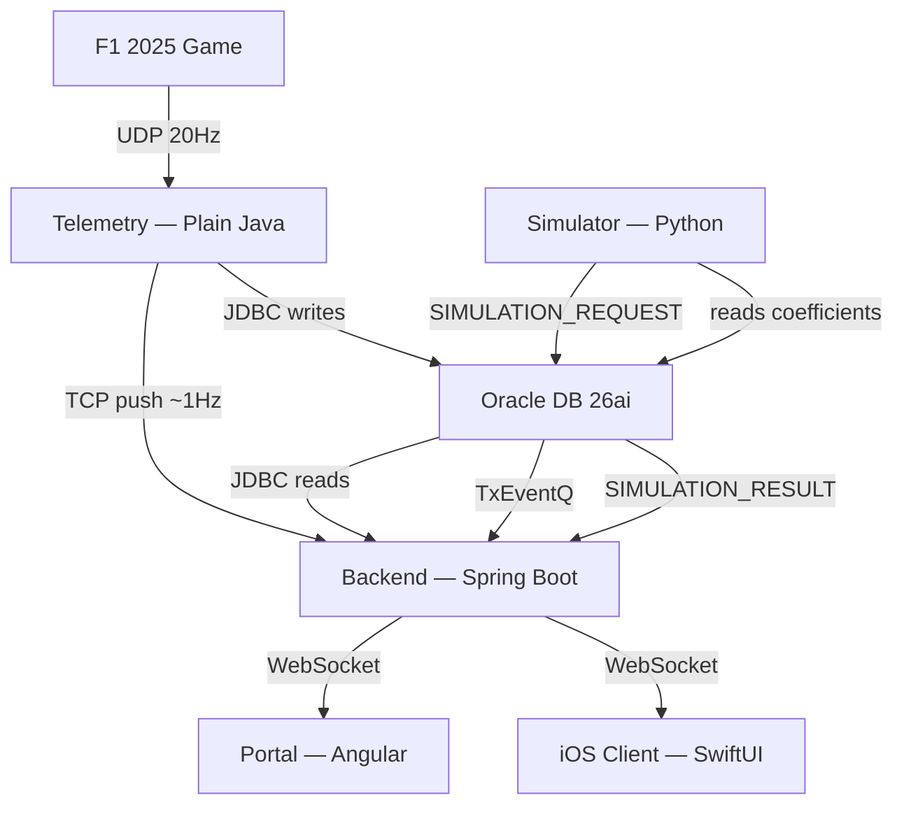
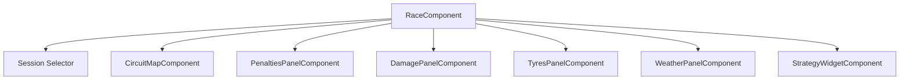
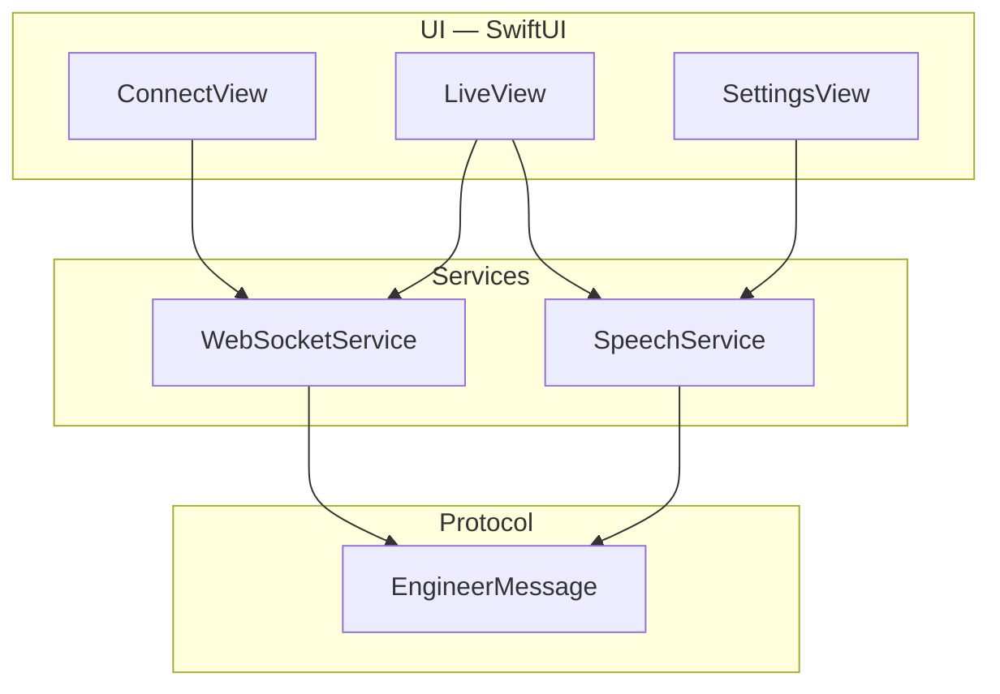

# Integration Points Between Components

## System Overview

## 1. Telemetry → Database (JDBC, direct write)

The telemetry server writes parsed UDP data directly to Oracle via JDBC + Oracle UCP connection pool ([Oracle Corporation, 2025](10-REFERENCES.md#oracle-ucp)). No intermediary.

- **Protocol:** JDBC (Oracle thin driver)
- **Direction:** Telemetry → Oracle
- **Data:** `sessions`, `participants`, `sector_snapshots`, `session_events`, `tyre_sets`, `final_classifications` (all 6 data tables from `04-DATABASE_DESIGN.md`)
- **Rate:** ~60 rows/lap for sector_snapshots (3 sectors x 20 cars), plus sporadic event/metadata rows
- **Batching:** JDBC `addBatch()` / `executeBatch()` for sector_snapshots (all 20 cars snapshotted at each sector boundary)
- **Connection config:** `telemetry/config.properties` — host, port, service name, credentials

## 2. Telemetry → Backend (TCP push, JSON-lines)

Live race state and session lifecycle events flow from telemetry to backend over a persistent TCP socket.

- **Protocol:** Plain TCP socket, newline-delimited JSON (`\n`-separated)
- **Direction:** Telemetry → Backend (telemetry connects to backend's TCP server port)
- **Data carried:**
  - **Race state** (~1Hz): current lap, positions, gaps, tyre compound/age, fuel, pit status, damage levels, weather — enough for the portal to render a live dashboard without querying the DB
  - **Session lifecycle events:** `sessionStarted`, `sessionEnded`, `safetyCarDeployed`, `retiredCar`, etc. — backend uses these to update its in-memory session state and notify the portal via WebSocket
- **Format:** Each message is a single JSON object on one line. A `type` field discriminates message kinds (e.g. `{"type":"raceState","data":{...}}`)
- **Reconnection:** Exponential backoff 3s → 6s → 12s → 24s → cap 30s, resets on success
- **Backend recovery on restart:** Queries DB for active session state (catch-up), then resumes from TCP stream

## 3. Database → Backend (JDBC, on-demand reads)

The backend reads from Oracle for historical data, calibration results, and simulation outputs. This is the standard request-driven path — not polling.

- **Protocol:** JDBC (Oracle thin driver + Oracle UCP)
- **Direction:** Backend ← Oracle
- **When:** In response to REST API requests from the portal (historical session data, calibration status, simulation results)
- **Tables read:** All tables, but primarily `sessions`, `sector_snapshots`, `calibration_coefficients`, and simulation result data
- **Connection config:** `backend/src/main/resources/application.properties` — Spring datasource config

## 4. Backend → Portal (WebSocket + REST)

Two channels serving different purposes:

### WebSocket (live push)
- **Protocol:** WebSocket over HTTP (Spring WebSocket / STOMP)
- **Direction:** Backend → Portal (server push)
- **Data:** Live race state relayed from the TCP stream (positions, gaps, tyres, fuel, weather, events). The backend receives race state via TCP from telemetry and immediately broadcasts it to connected WebSocket clients
- **Rate:** ~1Hz during a live session, matching the TCP push cadence
- **Topic:** `/topic/race-state` (STOMP destination)

### REST (historical / on-demand)
- **Protocol:** HTTP REST (JSON)
- **Direction:** Portal → Backend → Portal (request/response)
- **Endpoints (planned):**
  - `GET /api/sessions` — list sessions
  - `GET /api/sessions/{uid}` — session detail with participants
  - `GET /api/sessions/{uid}/sectors` — sector snapshot data for charts
  - `GET /api/calibration/{trackId}` — calibration coefficient status
  - `POST /api/simulation/run` — trigger a simulation run
  - `GET /api/simulation/{id}/results` — fetch simulation results
  - `GET /api/driver-ratings` — driver skill ratings (for outlier detection cold start)
  - `PUT /api/driver-ratings/{name}` — update a driver's skill rating

## 5. Calibration Trigger (via TxEventQ)

Calibration is a batch process that refits model coefficients from accumulated historical data. It runs in the backend process, triggered via TxEventQ ([Oracle Corporation, 2025](10-REFERENCES.md#oracle-txeventq)).

- **Trigger:** Automatic, fired when a session ends. `SessionStateHolder` enqueues to `CALIBRATION_REQUEST` via `QueueService`
- **Flow:** `sessionEnded` → `CALIBRATION_REQUEST` enqueued → `CalibrationQueueConsumer` dequeues → `CalibrationService.triggerCalibration()` → subprocess runs calibration pipeline → reads `sector_snapshots` from Oracle → fits coefficients → writes to `calibration_coefficients` table → WebSocket broadcast
- **Manual fallback:** `POST /api/calibration/run?trackId={id}` → enqueues to `CALIBRATION_REQUEST` → returns `202 Accepted`
- **Session lifecycle:** `TelemetryTcpServer` also enqueues session start/end events to `SESSION_LIFECYCLE` (multi-consumer queue) for future consumers
- **Scope:** Recalibrates all knobs for the track of the just-completed session, both PLAYER and AI regimes
- **Duration:** Seconds for early data volumes; the async task prevents blocking the main thread

## 6. Simulation Trigger (via TxEventQ)

Simulations are triggered automatically during live races (lap completions, pit stops, safety car changes) and manually via the portal.

- **Automatic trigger:** `SimulationOrchestrator` detects trigger conditions from the TCP state stream, debounces (3s), assembles a `RaceSnapshot`, and enqueues to `SIMULATION_REQUEST` via `QueueService`
- **Manual trigger:** Portal → `POST /api/simulation/run` or `/api/simulation/trigger` → Backend enqueues to `SIMULATION_REQUEST` → returns `202 Accepted` with jobId
- **Flow:** `SIMULATION_REQUEST` queue → Python simulator worker dequeues → loads calibration coefficients → `MonteCarloEngine.simulate()` → enqueues result to `SIMULATION_RESULT` → `SimulationResultConsumer` (Java) dequeues → updates job store → broadcasts via WebSocket
- **Simulator:** Python FastAPI service ([Ramirez, 2025](10-REFERENCES.md#fastapi)) (port 8081). REST endpoints remain available for direct use and testing. A background daemon thread polls the queue when `SIMULATOR_USE_DB=true`
- **Results:** Cached in-memory in `SimulationOrchestrator` (up to 50 jobs). Portal fetches via `GET /api/simulation/results/{jobId}`
- **Live re-simulation:** Debounced to at most once per 3 seconds to avoid flooding the queue

## 7. Shared Database

All components that access the database connect to the same Oracle AI Database 26ai instance and the same schema.

- **Instance:** Single Oracle 26ai container (Podman), exposed on the default port
- **Schema:** Single schema owner. All tables live in one schema — no cross-schema access needed
- **Connection config per component:**
  - `telemetry/config.properties` — JDBC URL, username, password
  - `backend/src/main/resources/application.properties` — Spring datasource config (same DB, same schema)
  - `simulator/db.py` — oracledb pool config (same DB, same schema)
- **Concurrent access:** Telemetry writes continuously; backend reads on demand; calibration reads/writes after sessions; simulator reads coefficients and communicates via TxEventQ queues. No write conflicts — telemetry owns data ingestion, calibration owns coefficient updates
- **Schema ownership:** A single DB user owns all tables. No per-component users for the POC

## 8. Build Independence & Interface Versioning

Backend and telemetry are kept as independent Gradle projects — no root multi-project build, no shared `common` module.

**Rationale:**
- They scale differently (telemetry is high-throughput plain Java; backend is Spring Boot)
- They have different lifecycles (telemetry may be redeployed independently of backend)
- Sharing compiled code creates coupling that outweighs the convenience for a PoC

**Interface between telemetry and backend:**
The only runtime interface is the TCP push socket (section 2 above). Both sides must agree on the JSON-lines message schema. To allow independent evolution:

- **Message versioning:** Each JSON message includes a `version` field (integer, starting at `1`). The producer (telemetry) sets the version; the consumer (backend) must handle all supported versions.
- **Backward compatibility rule:** New fields may be added without bumping the version. Removing or renaming a field requires a version bump. The consumer ignores unknown fields.
- **Schema definition:** The canonical message schemas are documented in `design/06-INTEGRATION.md` (this file) and updated when the interface changes. There is no shared code artifact — each side implements its own serialization/deserialization.

**Interface between backend and database:**
Both telemetry and backend connect to the same Oracle schema (section 7 above). The database schema (managed by Liquibase, see todo 05) is the shared contract. Both sides depend on the table definitions, not on each other's code.

**Duplicate dependencies are accepted:** Both projects independently declare their JDBC driver and other shared dependencies. This is a conscious trade-off for build isolation.

## 9. Portal Live Dashboard (Angular)

The portal's Race view is a modular Angular component tree that renders live race state received via WebSocket.

### Architecture

- **Reactivity:** Angular signals ([Google, 2025](10-REFERENCES.md#angular-signals)) (`signal()`, `computed()`) for granular state tracking. The race service exposes signals that child components bind to directly — no manual subscription management.
- **Session selector:** Queries `GET /api/sessions` for active sessions. Selecting a session switches the WebSocket subscription and reloads all child components with new state.
- **Circuit map:** SVG-based rendering with a fixed viewBox. Car positions are mapped to track coordinates using sector progress. Renders DRS zones, yellow flag sectors, pit entry/exit. Team colours from a static lookup table.
- **Strategy widget:** Displays the latest Monte Carlo simulation result — predicted finishing position with 95% confidence intervals, iteration count, convergence status. Links to the full Strategy view for detailed comparison.
- **Info panels:** Each panel subscribes to a slice of the race state (penalties, damage, tyres, weather) and renders a focused view. Standalone components with no cross-dependencies.

## 10. iOS Voice Client (SwiftUI)

A native iOS app that receives race engineer messages via WebSocket and speaks them aloud using text-to-speech. This is the delivery mechanism for the race engineer voice described in `08-RACE_ENGINEER_VOICE.md`.

### Architecture

Three-layer design:

- **WebSocketService:** `@Observable` for SwiftUI binding. Connection states: disconnected → connecting → connected (with reconnecting as a transient state). Exponential backoff reconnect: delay = min(2^attempt, 30) seconds, max 10 attempts. Automatically converts HTTP/HTTPS URLs to WS/WSS. Filters incoming messages by `sessionUid` to prevent cross-session contamination.
- **SpeechService:** `AVSpeechSynthesizer` ([Apple Inc., 2025](10-REFERENCES.md#apple-tts)) with a priority queue. IMMEDIATE-priority messages interrupt current speech; NORMAL-priority messages queue behind active speech. Audio session configured as `.playback` with `.duckOthers` (lowers game audio during speech). Voice: English (GB), rate 0.48, 0.1s inter-message delay.
- **Thread safety:** `@unchecked Sendable` + `@MainActor` for safe concurrent access from WebSocket callbacks to UI state updates.

## Decision Rationale: TCP Push Architecture

Five options were evaluated for the telemetry-to-backend data path. Plain TCP won.

### Options Evaluated

| Option | Approach | Why it lost |
|--------|----------|-------------|
| **A. REST** | HTTP POST from telemetry to backend endpoints | Adds HTTP client overhead per message. Request/response model is wrong for a persistent data stream. Telemetry must handle HTTP client concerns (timeouts, retries, connection pooling) |
| **B. WebSocket** | Telemetry opens WS connection to backend | HTTP upgrade handshake and frame masking are designed for browser security — unnecessary between two JVM processes. Requires a WebSocket client library in telemetry |
| **C. gRPC** | Protobuf streaming RPCs | Right tool for production microservices with multiple consumers and strict API contracts. For a single-instance PoC with one producer and one consumer, protobuf compilation and gRPC runtime are overhead without payoff |
| **D. DB polling** | Backend polls Oracle for new rows | Works but adds 1-2s latency. Extra read load on the database for data that's immediately available in memory |
| **E. Plain TCP** | Persistent socket, newline-delimited JSON | **Chosen** — see below |

### Why Plain TCP Won

- **Zero new dependencies.** `java.net.Socket` and `java.io.OutputStream` are in the JDK. The telemetry server stays zero-dependency
- **Natural fit for a persistent data stream.** TCP provides reliable, ordered byte stream — no per-message connection overhead, no HTTP framing, no compilation step
- **Sub-second latency.** Data goes from telemetry memory → socket write → backend socket read → WebSocket broadcast. Full pipeline (UDP arrival to portal display) under 100ms
- **One channel for everything.** Same TCP connection carries continuous race state and discrete lifecycle events. No protocol splitting
- **Simple failure model.** Connection drops are detected immediately by both sides. Telemetry reconnects with exponential backoff. Backend accepts new connection and resumes

### JSON-lines Protocol Choice

Newline-delimited JSON over alternatives:

- **Length-prefixed binary:** More efficient but harder to debug. `tail -f` on a TCP stream shows readable JSON; binary requires tooling
- **Protobuf/MessagePack:** Better compression but adds serialization dependencies. At ~1KB per message at 1Hz, bandwidth is irrelevant
- **Custom binary format:** Unnecessary — the parsing cost is on the UDP side, not the TCP side

### Single Backend Instance Assumption

This architecture assumes a single backend instance. If multiple instances were needed, options would include a message broker (Redis Pub/Sub, Kafka), connecting to all instances, or a shared state store. None are needed for the PoC.

## Summary of Protocols

| From | To | Protocol | Direction | Data Format | Frequency |
|------|-----|----------|-----------|-------------|-----------|
| F1 Game | Telemetry | UDP | Game → Telemetry | Binary (game spec) | 20Hz |
| Telemetry | Oracle DB | JDBC | Telemetry → DB | SQL (prepared stmts) | ~60 rows/lap |
| Telemetry | Backend | TCP socket | Telemetry → Backend | JSON-lines | ~1Hz |
| Backend | Oracle DB | JDBC | Backend ↔ DB | SQL | On demand |
| Backend | Portal | WebSocket | Backend → Portal | JSON | ~1Hz (live) |
| Portal | Backend | HTTP REST | Portal → Backend | JSON | On demand |
| Backend | Simulator | TxEventQ | Backend → DB → Simulator | JSON (queue) | On trigger |
| Simulator | Backend | TxEventQ | Simulator → DB → Backend | JSON (queue) | On completion |
| Backend | Calibration | TxEventQ | Backend → DB → Consumer | JSON (queue) | On session end |
| Backend | iOS Client | WebSocket | Backend → iOS | JSON | ~1Hz (live) |
