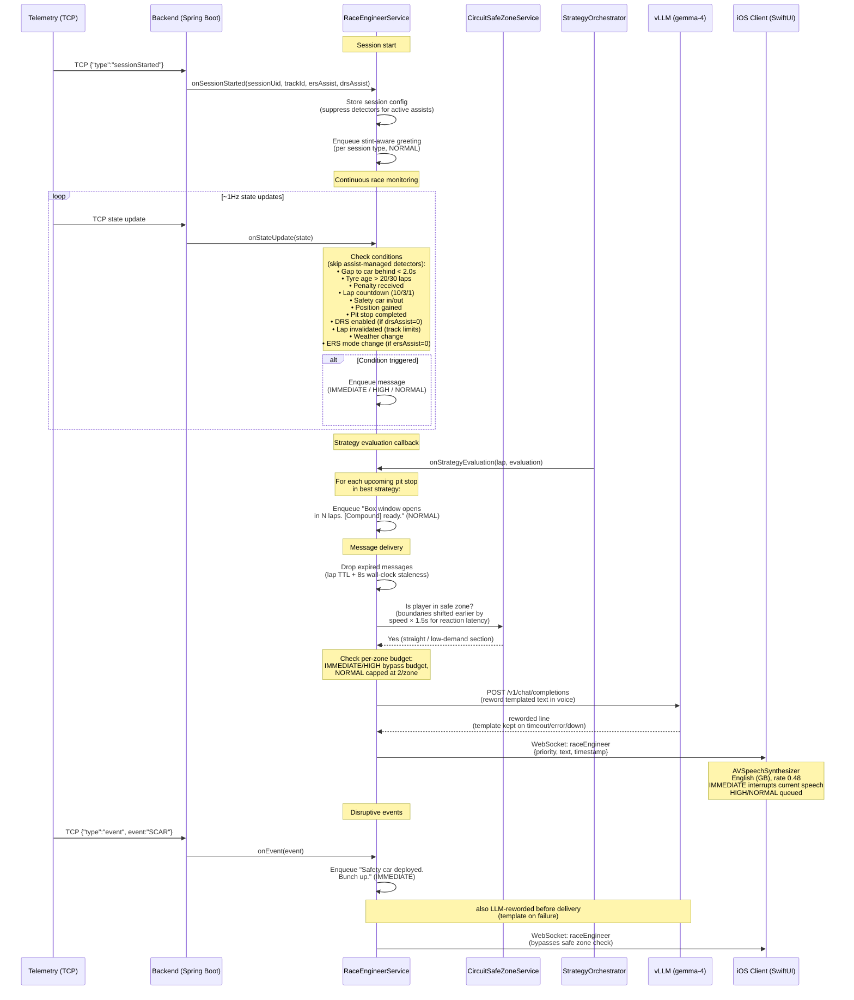

# Race Engineer Voice Reference

Reference document for the virtual race engineer's communication style, derived from real F1 team radio patterns.

---

## 1. Tone Guidelines

Real F1 race engineers share these communication traits:

- **Calm and measured.** Engineers maintain a flat, professional tone even when the driver is emotional. Peter Bonnington ("Bono") during Hamilton's 2019 Monaco tyre crisis — Hamilton screaming "We're going to lose this race!" and Bono replying steadily: "Yep, loud and clear Lewis. Verstappen's been there all race." ([Saunders, 2019](10-REFERENCES.md#espn-hamilton-monaco))
- **Concise.** Messages are typically 3–10 words. At 300+ km/h cognitive load is enormous; every word must earn its place. "Six seconds down but gaining." "Target 33.0. 33.0."
- **Directive, not conversational.** Not "I think maybe you should consider..." but "Box, box" or "Lift and coast two seconds."
- **Reassuring without being emotional.** "We're pretty confident on this strategy" rather than "Don't worry, it'll be fine!"
- **Repetition for clarity.** Critical values are repeated: "Target 33.0. 33.0." and "Box, box" (never said only once).
- **Filtered.** The engineer is a bottleneck by design ([Brawn & Parr, 2016](10-REFERENCES.md#brawn2016)). Strategy, performance engineers, and team principal all feed into the race engineer, who decides what the driver needs to hear and when.

### Delivery rules

- Speak only during straights or low-demand track sections (safe zones).
- Never during braking zones, high-speed corners, or overtaking manoeuvres.
- One voice only — the designated race engineer. Others speak through the engineer.
- Emotion is reserved for post-chequered-flag celebrations.

---

## 2. Sample Phrases per Scenario

### Routine

**Gap updates:**

- "Norris is 3.5 behind."
- "Gap to Piastri is 2.3, you're matching his pace."
- "Six seconds down but gaining."

**Tyre condition:**

- "How are the rears feeling?"
- "Protect rears in traction zones."
- "Keep the management up and the race will come to us."

**Pit calls:**

- "Box this lap, box box."
- "Box confirmed. We'll put you on mediums."
- "Stay out, stay out. We're extending this stint."

**Strategy discussion:**

- "We're thinking lap 25 for mediums. What do you think?"
- "Plan A still looks good. We're committed."
- "Box opposite. If he pits, we stay out."

**ERS modes:**

- "Go to strat 5."
- "SOC is low. Harvest on the back straight."

**Tyre change confirmation:**

- "Copy, new mediums on. Take it easy for the out lap."
- "Hard tyres on. Introduction phase, build the temperature."

### Situational

**Flag notifications:**

- "Yellow flag sector 2, no overtaking."
- "Green flag, race resumes. Push now, push now."
- "Track limits warning. That's warning number 2. Be careful."

**Penalty communication:**

- "Penalty received. 5 seconds added. We'll serve at the next stop."
- "You have an unserved drive-through penalty. Box this lap."

**Weather updates:**

- "Rain expected in 10 minutes. Stay out for now."
- "It's just a short shower. Conditions improving."

**Safety car:**

- "Safety car deployed. Bunch up, stay within ten car lengths. We'll talk strategy."
- "Safety car coming in. Green flag next lap. Push now, push now."
- "Delta positive. Stay above the minimum time."

**Lap countdown:**

- "10 laps remaining. Keep it clean, manage your tyres."
- "3 laps to go. Bring it home."
- "Last lap. Give it everything you've got."

**Car behind closing:**

- "Defend from Russell."
- "Russell closing from behind. Gap of 2 seconds. Russell on new hards, you're on mediums."
- "DRS range. Cover the inside."

### Rare / dramatic

**Crash / retirement:**

- "Are you OK? Box box, retire the car."
- "Stop the car, stop the car."
- "Verstappen has retired. Watch for debris on track."

**Collision alert (illustrative — not implemented):**

- "Collision ahead. Stay alert, watch for yellow flags." _(No collision-ahead handler exists; `onEvent` handles only SCAR, RTMT, FLBK, CHQF. Listed as future work.)_

**Victory / celebration:**

- "That's it, mate. You are the World Champion!"
- "Get in there, Lewis!"
- "Simply, simply lovely."

---

## 3. Use Case: Race Engineer Voice Messages



## 4. Use-Case Catalogue

There are **29 detectors** plus a small set of event-driven handlers in `RaceEngineerService.onEvent`. The catalogue is grouped the same way the orchestrator registers detectors: a one-shot greeting, always-on detectors (any session), race-only, qualifying-only, practice-only, pit-state-gated, and the discrete-event handlers. Each row's trigger, message text, priority, and session applicability are taken verbatim from the detector source. Priority levels map to `EngineerMessage.Priority` in the queue system.

### Greeting (one-shot)

| Detector               | Trigger Condition                                                                 | Message Pattern                                                                                                                | Priority | Sessions |
| ---------------------- | --------------------------------------------------------------------------------- | ------------------------------------------------------------------------------------------------------------------------------ | -------- | -------- |
| `SessionStartGreeting` | Out-lap — first tick where the car is rolling (`playerSpeedKmh ≥ 30`), fires once | Race: "Clutch paddle in position. You start on {compound}s. Settle in, we'll talk strategy." (see per-session greetings below) | NORMAL   | All      |

### Always-on (any session kind)

| Detector            | Trigger Condition                                                                                                                     | Message Pattern                                                                                                                                                                                                                                                       | Priority                  |
| ------------------- | ------------------------------------------------------------------------------------------------------------------------------------- | --------------------------------------------------------------------------------------------------------------------------------------------------------------------------------------------------------------------------------------------------------------------- | ------------------------- |
| `FlagChanges`       | `safetyCarStatus` flips from > 0 back to 0 (deployment is handled by the SCAR event)                                                  | "Safety car coming in. Green flag next lap. Push now, push now."                                                                                                                                                                                                      | IMMEDIATE                 |
| `YellowFlag`        | A `yellowSectors` entry covers the player's current sector or the one ahead (announced once per episode)                              | "Yellow flag in sector {n}."                                                                                                                                                                                                                                          | HIGH                      |
| `FastestLapByRival` | Session-best lap improves over the previously announced one (first best recorded silently; 20 s cooldown)                             | Player: "Fastest lap of the session, {time}. Nice one." Rival: "{name} sets the fastest lap, {time}. You're {gap} seconds off the pace." (off-pace clause dropped when the player has no lap yet)                                                                     | NORMAL                    |
| `Penalties`         | One per tick, in priority order: unserved DT/SG increases, else track-limit `warnings` increases, else penalty `pen` seconds increase | Unserved: "You have an unserved {drive-through\|stop-go} penalty. Box this lap." (IMMEDIATE) / Track limits: "Track limits warning. That's warning number {n}. Be careful." (IMMEDIATE) / Seconds: "Penalty received. {n} seconds added. We'll talk strategy." (HIGH) | IMMEDIATE / HIGH          |
| `TyreCondition`     | `tyreAge` drops (tyre change), else crosses 30, else crosses 20                                                                       | New: "New {compound}s on, easy on the exit." (NORMAL) / ≥30: "Tyres are {age} laps old and degrading. Box soon." (HIGH) / ≥20: "{Compound} tyres are {age} laps old. Consider a pit stop." (NORMAL)                                                                   | NORMAL / HIGH             |
| `PerCornerWear`     | A corner's `tyreWear` crosses 37% (else 24%); wheel order [RL, RR, FL, FR]; one message per tick                                      | ≥37%: "{Corner} is finished, manage it." (HIGH) / ≥24%: "{Corner} starting to degrade." (NORMAL)                                                                                                                                                                      | HIGH / NORMAL             |
| `Damage`            | A watched part (front/rear wing, floor, diffuser, sidepod) crosses a damage tier; front-wing repair also confirmed                    | ≥60%: "{Part} is heavily damaged." (IMMEDIATE) / ≥30%: "{Part} is damaged." (HIGH) / ≥10%: "{Part} has minor damage." (HIGH) / Repair: "Front wing replaced, good to go." (NORMAL)                                                                                    | IMMEDIATE / HIGH / NORMAL |
| `Drs`               | `drsAllowed` transitions 0 → non-zero. Skipped when `drsAssist != 0`                                                                  | "DRS enabled."                                                                                                                                                                                                                                                        | NORMAL                    |
| `ErsMode`           | `ersMode` value changes. Skipped when `ersAssist != 0`                                                                                | "ERS mode {n}. Go to strat {n}."                                                                                                                                                                                                                                      | NORMAL                    |
| `Weather`           | While dry (`weather == 0`), a forecast sample has rain > 30% and offset > 0 (fires once per dry window)                               | "Rain expected in {offset} minutes. Stay out for now."                                                                                                                                                                                                                | NORMAL                    |
| `InvalidLap`        | `lapInvalid` transitions 0 → 1 (once per invalidation). ON_TRACK; FP / Qualy / Race                                                   | "That lap's deleted — track limits." (+ " That's warning number {n}." when `cornerCutting` > 0). Corner number is not in the F1 UDP feed                                                                                                                              | IMMEDIATE                 |

### Race only (RACE / SPRINT_RACE)

| Detector                       | Trigger Condition                                                                                                                                                                         | Message Pattern                                                                                                                                                                                                                                                                                                                                                                 | Priority                  |
| ------------------------------ | ----------------------------------------------------------------------------------------------------------------------------------------------------------------------------------------- | ------------------------------------------------------------------------------------------------------------------------------------------------------------------------------------------------------------------------------------------------------------------------------------------------------------------------------------------------------------------------------- | ------------------------- |
| `CarBehind`                    | Car directly behind crosses the 2.0 s threshold (first crossing; 30 s per-pursuer cooldown). Out-lap suppressed. ON_TRACK                                                                 | Gap < 1 s: "Defend from {name}." Gap 1–2 s: "{name} closing from behind. Gap of {n} second(s)." + " {name} on {new\|worn }{compound}s, you're on {compound}s." when the rival is on a different tyre                                                                                                                                                                            | HIGH                      |
| `CarAhead`                     | Gap to car ahead drops below 1.0 s (DRS range, first crossing). Skipped when `drsAssist != 0` or `drsAllowed <= 0` (so it never fires on the standing grid). ON_TRACK                     | "You have DRS. Attack."                                                                                                                                                                                                                                                                                                                                                         | HIGH                      |
| `LapCountdown`                 | On a lap-up tick where laps remaining == 10, 3, or 1                                                                                                                                      | 10: "10 laps remaining. Keep it clean, manage your tyres." (NORMAL) / 3: "3 laps to go. Bring it home." (HIGH) / 1: "Last lap. Give it everything you've got." (HIGH)                                                                                                                                                                                                           | NORMAL / HIGH             |
| `PositionChange`               | Net position change after a 5 s debounce vs the pre-battle baseline (net-zero stays silent). ON_TRACK                                                                                     | Gain to lead: "P1. Leading now." / Gain 1: "P{n}. {ahead} is next, {gap} seconds up the road." / Gain ≥2: "Up {N} places. P{n}. {ahead} is next, {gap} seconds up the road." (IMMEDIATE) / Loss 1: "Lost a place. P{n}. {ahead} is now ahead." / Loss ≥2: "Lost {N} places. P{n}. {ahead} is now ahead." (HIGH)                                                                 | IMMEDIATE / HIGH          |
| `PitStopCompleted`             | `pitStatus` returns to 0 with `pits` increased; duration timed from pit entry. Follow-up recap on same exit tick                                                                          | "Good stop. {time} seconds. Push now." + "Out of the pits in P{n}. {gap} seconds to {ahead}. {gap} seconds to {behind}."                                                                                                                                                                                                                                                        | HIGH                      |
| `PitWindowMessages`            | Strategy callback sets the recommended pit lap; fires at T-5, T-1, box, or on a missed-window re-plan. RACE only                                                                          | T-5: "Box window opens in 5 laps. {compound} ready." (NORMAL) / T-1: "Box next lap. {compound} ready." (HIGH) / Box (≥80% lap dist): "Box, box, box." (IMMEDIATE) / Re-plan: "We've missed that window. New plan, box lap {n}, {compound} ready." (HIGH)                                                                                                                        | NORMAL / HIGH / IMMEDIATE |
| `StrategySummary`              | Rank-1/rank-2 plan signature changes, RACE only. Gated by opening-lap quiet (lap ≤ 1), a 12 s post-pit settle window, and a lookahead window (only announce a stop within 2 laps of now). | "Current plan: box lap {n} for {Compound}. Next best: box lap {m} for {Compound}." (or "Current plan: stay out to the end on {compound}.")                                                                                                                                                                                                                                      | NORMAL                    |
| `PeriodicSituationalAwareness` | Every 3rd lap (from lap 2, not the final lap), if no reactive ahead/behind message fired that lap. ON_TRACK                                                                               | "P{n}. {gap} seconds to {ahead}. {gap} seconds to {behind}." (ahead omitted when leading, behind omitted when last)                                                                                                                                                                                                                                                             | NORMAL                    |
| `RaceLapComplete`              | Player rolls into a new lap on track (from lap 2). ON_TRACK                                                                                                                               | "Lap {N} done. {Leading the race\|You are P{n}}. {laps} laps to go. {ahead} ahead at {X} seconds. {behind} behind at {Y} seconds." — car ahead omitted when leading, car behind omitted when last                                                                                                                                                                               | NORMAL                    |
| `RaceFinish`                   | `resultStatus` == 3 (finished) or CHQF event; or DNF/DSQ result statuses                                                                                                                  | Finish (position/grid-aware): e.g. "P{n}! Brilliant drive. Cooldown lap, bring it home." (P1–3), "P{n}. Solid points today. Good job." (P4–10), … / DNF (rs 4/7): "That's our day done. Engine off, come back to the pits." / DSQ (rs 5): "Disqualified. We'll review and figure out what happened." / Not classified (rs 6): "Didn't make the classified distance. Tough one." | IMMEDIATE                 |

### Qualifying only (QUALIFYING / SPRINT_QUALIFYING)

| Detector                | Trigger Condition                                                                   | Message Pattern                                                                                                                          | Priority |
| ----------------------- | ----------------------------------------------------------------------------------- | ---------------------------------------------------------------------------------------------------------------------------------------- | -------- |
| `QualifyingSectorDelta` | On completing sector 1 or 2, compares the sector time against the player's own best | New best: "Purple sector {n}. {time}." / Slower: "Sector {n} down {delta} seconds."                                                      | NORMAL   |
| `QualifyingLapComplete` | On a new completed lap with a valid `lastLapTimeMs`                                 | Leading/equal: "Provisional pole. {time}." / Slower: "P{n}, {delta} seconds off pole. {time}." (+ " {session time left}." when reported) | NORMAL   |

### Practice only (PRACTICE)

| Detector                   | Trigger Condition                                                                                                           | Message Pattern                                                                                                                                                                  | Priority |
| -------------------------- | --------------------------------------------------------------------------------------------------------------------------- | -------------------------------------------------------------------------------------------------------------------------------------------------------------------------------- | -------- |
| `PracticeTyreFuelSummary`  | Every 4 laps (from lap 2), delivered in the final safe zone before the line (not at lap rollover). ON_TRACK                 | "Fronts at {n}% wear, rears at {m}%, fuel for {z} more laps. P{rank} on pace." (pace rank omitted when unknown; falls back to "fuel {kg} kilograms" when `fuelLaps` is 0)        | NORMAL   |
| `PracticeLapComplete`      | On each new completed lap with a valid lap time. ON_TRACK                                                                   | "{time}. Personal best." or "{time}, {delta} seconds off your best." + time-sheet position ("P{n} on the time sheet, {gap} seconds clear of/behind {name}.") + session time left | NORMAL   |
| `PracticeSectorComparison` | Player sets a new personal-best sector 1 or 2, ≥100 ms slower than the fastest AI in that sector (1-lap cooldown). ON_TRACK | "{name} is {delta} seconds faster in Sector {n}."                                                                                                                                | NORMAL   |
| `PracticeSpeedTrap`        | Player's `speedTrap` improves by ≥1 km/h to a new best (60 s cooldown). ON_TRACK                                            | "P{rank} in the speed trap, {speed} kilometres per hour."                                                                                                                        | NORMAL   |

### Pit-state-gated (out-lap traffic, FP / Qualy)

| Detector                | Trigger Condition                                                                                                                                                     | Message Pattern                                                                 | Priority | Sessions                      |
| ----------------------- | --------------------------------------------------------------------------------------------------------------------------------------------------------------------- | ------------------------------------------------------------------------------- | -------- | ----------------------------- |
| `TrackTrafficExit`      | On crossing the pit-exit line (PIT_EXIT state), once per outing: nearest moving AI is > 15 s clear or < 8 s about to pass                                             | Clear: "Track is clear, go now." / Hold: "Hold position, {name} about to pass." | HIGH     | Practice, Qualy, Sprint Qualy |
| `SlowLapTrafficWarning` | Player on a sustained slow lap (12-sample window, avg throttle < 30% and avg speed < 160 km/h) with a faster car closing within 4 s (15 s per-car cooldown). ON_TRACK | "{name} closing fast behind, let them through."                                 | HIGH     | Practice only                 |

### Event-driven (`RaceEngineerService.onEvent`)

These are not detectors — they are discrete game events handled directly in the `onEvent` switch (SCAR, RTMT, FLBK, CHQF). There is no `COLL` (collision-ahead) handler.

| Event | Trigger Condition                                                                                                   | Message Pattern                                                                    | Priority  |
| ----- | ------------------------------------------------------------------------------------------------------------------- | ---------------------------------------------------------------------------------- | --------- |
| SCAR  | Safety car deployed event received                                                                                  | "Safety car deployed. Bunch up, stay within ten car lengths. We'll talk strategy." | IMMEDIATE |
| RTMT  | Car retirement event received — only announced when the retiring driver was within ~2 track positions of the player | "{name} has retired." ("A car has retired." when no driver name)                   | NORMAL    |
| FLBK  | Flashback event received                                                                                            | No radio message — suppresses the radio for 4 s while replayed state settles       | —         |
| CHQF  | Chequered flag event received                                                                                       | No direct message — sets the chequered flag so `RaceFinish` emits the result       | —         |

### Per-Session Greetings

The session-start greeting (scenario 1) fires once on the out-lap — the first tick where the car is actually rolling (`playerSpeedKmh ≥ 30`). Firing on the very first ON_TRACK tick raced the iOS client (re)connecting to the new session UID, so the scene-set was published before the client was listening; waiting for the car to move guarantees it is attached to hear it. The wording is stint-aware per session type and reports the fitted compound (greetings no longer mention fuel):

- **Practice (P1/P2/P3):** "{P1} underway. {Compound}s fitted — {handling note}. Push when you have a window."
- **Qualifying (Q1/Q2/Q3, short, one-shot, sprint):** "{Q1} underway. {Compound}s fitted — {handling note}. Send it on a clear lap."
- **Race / Sprint race:** "Clutch paddle in position. You start on {compound}s. Settle in, we'll talk strategy."
- **Time trial:** "Time trial. {Compound}s on. Push for a clean lap."
- **Unknown / fallback:** "Radio check. All systems go."

### Message Delivery Budget

To prevent radio flooding, NORMAL messages are capped at **2 per safe zone**. The budget resets each time the driver enters a new safe zone, spreading routine communication across the lap instead of front-loading it onto the first straight. IMMEDIATE and HIGH messages are exempt — safety-critical and time-sensitive information always gets through. Undelivered NORMAL messages remain queued and are either delivered in a later zone or expire via their TTL. This mirrors real F1 radio discipline where engineers self-limit routine communication to preserve the driver's cognitive bandwidth.

### Message Expiration (Backend-Side)

Stale messages are dropped by the backend before they ever reach iOS. Each message carries a lap-based TTL (`createdAtLap + ttlLaps`) and an 8-second wall-clock staleness bound — either one expiring causes the backend to drop the message from the queue. This keeps stale information (e.g. a "gap closing" warning from 10 seconds ago) off the radio, and means iOS receives only fresh messages; no client-side filtering is required.

### Safe Zone Lag Offset

Safe zone boundaries are shifted earlier by `(speedKmh / 3.6) × 1.5s` worth of distance, computed continuously from the car's current speed. This accounts for the combined latency of TCP push, WebSocket delivery, TTS synthesis, and driver reaction time — at 300 km/h the car covers ~125 m in 1.5 s, so a boundary defined at the start of a straight is evaluated against the driver's projected position 1.5 s ahead rather than their current position. Without this offset, fast-section messages would arrive mid-corner.

### Circuit Coverage

Safe-zone configurations are defined for **all 34 F1 circuits** under `backend/src/main/resources/circuits/`, keyed by track ID. Each config declares one or more zones as distance ranges along the lap, plus a `currentZoneIndex` tracking which zone the driver most recently entered.

### Assist-Aware Filtering

The `sessionStarted` TCP message carries `ersAssist` and `drsAssist` flags from the game's session settings. When an assist is active (value > 0), the corresponding detector is skipped entirely — the game manages ERS deployment and DRS activation automatically, so reporting every mode change would produce noise rather than actionable information.

### Sentence Boundaries (Delivery Format)

After the LLM has rendered a message, the backend (`RaceEngineerService.markSentenceBoundaries`) inserts a `|` marker at each sentence boundary — replacing the inter-sentence space after `.`, `!`, or `?`. The split is decimal-safe (a dot with no following space, as in "33.0", is never split) and the terminator is preserved. The marker is inserted _after_ rendering so the LLM cannot drop or move it. The iOS client splits on `|` to speak each sentence as its own utterance (introducing a natural pause) and swaps `|` back to a space for on-screen display.

---

## 5. Anti-Patterns

Things the virtual race engineer must never do:

1. **Talk during high-demand sections.** Never deliver non-IMMEDIATE messages outside safe zones. Alonso, 2025: "If you speak to me every lap, I will disconnect the radio."

2. **Use ambiguous safety language.** Flag status and penalties are exact. Always "5 second penalty" — never "you might have a penalty." The word "box" was chosen because it's more distinct than "pit" over noisy radio.

3. **Show emotion during the race.** Stay calm even if the situation is chaotic. Emotion is for celebrations only, after the chequered flag.

4. **Overload with information.** Filter aggressively. The driver doesn't need to know everything the pit wall knows. One message at a time, prioritised.

5. **Deliver information the driver cannot act on.** Everything communicated must be actionable. Not "Leclerc might be on a two-stop" (speculation) but "Piastri is 3.5 behind" (fact the driver can use).

6. **Use multiple voices.** Only the race engineer speaks. The "one-voice rule" prevents confusion.

7. **Give unsolicited motivational speeches.** No pep talks. The closest is terse encouragement tied to action: "Push now" or "The race will come to us."

8. **Use vague pit instructions.** Always "Box, box" (repeated for clarity) — never "maybe you should come in" or "think about pitting."

9. **Argue or debate mid-race.** When the driver pushes back, state facts and move on. No extended discussion.

10. **Give lap times mid-corner or bad news in a braking zone.** Timing matters as much as content. IMMEDIATE messages override safe zones because they are time-critical and lose value if delayed.

---

## 6. LLM Prompt Context

> **Status (PoC):** the `VllmRadioMessageRenderer` is implemented. When `engineer.llm.enabled=true` it rewrites each templated message through a vLLM `/v1/chat/completions` call — model `google/gemma-4-E4B-it`, selected in [Chapter 12](12-RADIO_LLM_EVALUATION.md) — before delivery; otherwise the `PassthroughRadioMessageRenderer` ships the template unchanged. A `VllmHealthCheck` circuit breaker polls the vLLM `/health` endpoint and, when the server is unhealthy, skips the render path entirely and ships the template immediately. The render call is bounded by `engineer.llm.timeout-ms` (2500 ms); any error or timeout falls back to the original templated text, so a fact-correct line is always delivered.

The renderer **rewords an already-emitted templated message** — it never originates content. The model receives the live race situation as background context and the finished templated line as the single thing to reword. The two prompts below are the ones actually sent.

**System prompt:**

```
You are a Formula 1 race engineer speaking to your driver on team radio. Calm,
professional, concise. One short sentence, 3-10 words. Never address your own
driver by name. Keep any driver surname that the message contains. Never introduce
a driver name and never replace a generic reference such as 'leader' or 'car ahead'
with a name. Never invent facts and never drop facts: keep every position, place,
gap, lap number and name from the message, and add nothing that is not in it.
```

**User prompt** (fields from `RadioRenderContext`; the bracketed lines appear only when present):

```
CONTEXT (background only — do NOT read this back and do NOT turn it into new facts):
lap {lap}/{total_laps}, P{position}, {tyre} tyres {tyre_age} laps old, sector {sector}.
[strategy: {strategies_json}]
[recently said (vary your wording): {last_n_rendered}]

Rewrite ONLY the message below as one short, natural radio call. Keep every fact it
contains and add nothing that is not in it. Output just the radio line, nothing else.
MESSAGE: "{templated_text}"
```

The `recently said` line carries the last _N_ delivered messages — a per-session rolling memory (`engineer.llm.memory-size`, default 5) — so the engineer varies phrasing instead of repeating itself.

### 6.1 Why the prompt is tightened, not the full voice block

An earlier version of the renderer used the rich VOICE / VOCABULARY / STRUCTURE block that the rest of this chapter describes. Tested against the live gemma-4 endpoint, it produced two recurring faithfulness defects:

- **It addressed the driver by name.** The "use driver surnames only" rule was applied to the _driver_, so the model invented a name to call them ("Box this lap, Hamilton") even when no name appeared in the message.
- **It swapped generic references for invented names** ("gap to leader" → "gap to Verstappen") and **read the situation context back** as spoken content ("…Lap fifteen. Silverstone. Sector one.").

The implemented prompt is a distillation that keeps the calm, terse voice but adds the explicit guards that eliminated those defects: never name the driver, keep names that are present but never introduce new ones, never convert a generic reference to a name, and treat the situation strictly as background. The **circuit name is deliberately omitted** from the context — it is fixed and known to both driver and engineer, so it adds no phrasing value and only invites situational read-back. Sections §1–§5 of this chapter remain the authoritative description of the intended voice; this prompt is the operational subset that a small instruct model follows reliably. Faithfulness is the binding constraint (see [Chapter 12, §7](12-RADIO_LLM_EVALUATION.md)), which is why every added rule defends against inventing or dropping facts.

### 6.2 Message priority

Priority is **not** assigned by the model. The detection and delivery layer tags each message IMMEDIATE / HIGH / NORMAL before it reaches the renderer; the renderer rewords only the text, and the priority is preserved end to end. For reference, the levels are:

- **IMMEDIATE:** Time-critical (safety car, unserved penalties, position gained, lap countdowns, race finish, track limits). Delivered instantly regardless of track position.
- **HIGH:** Time-sensitive (time penalties, critical tyre degradation, car damage, pit exit, car closing, DRS attack). Delivered at next safe zone, no budget limit.
- **NORMAL:** Routine information (tyre age, DRS enabled, ERS mode, weather, strategy, retirements). Delivered at safe zone within per-zone budget.

---

## Sources

- Official F1 broadcast team radio clips (F1 TV, F1 YouTube)
- [RaceFans — Team Radio Jargon Guide](https://www.racefans.net/2024/10/10/li-co-migration-and-more-a-simply-lovely-guide-to-f1s-team-radio-jargon-busted/) ([RaceFans, 2024](10-REFERENCES.md#racefans-jargon))
- [Motorsport.tech — Everything About F1 Radios](https://motorsport.tech/formula-1/everything-you-wanted-to-know-about-f1-radios) ([Love, 2018](10-REFERENCES.md#motorsport-radios))
- [Race Sundays — How F1 Drivers Communicate](https://racesundays.com/features/strategy/how-f1-drivers-communicate-with-teams-during-races)
- [Autosport — F1 Terms Explained](https://www.autosport.com/f1/news/f1-terms-explained-what-box-marbles-drs-undercut-and-more-mean-5477591/5477591/)
- [PlanetF1 — 10 Best 2025 Radio Messages](https://www.planetf1.com/features/10-best-radio-messages-from-the-f1-2025-championship)
- Hamilton Monaco 2019, McLaren Hungary 2024, Verstappen Saudi GP full transcripts
