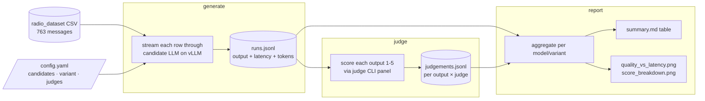

# Radio Message LLM Evaluation

How the virtual race engineer's natural-language renderer was selected. This chapter documents `radiobench`, the offline test bench that runs real team-radio messages through several candidate LLMs, scores their rewrites with a panel of judges, and balances quality against latency to choose a production model. It builds directly on the voice and tone requirements in [Race Engineer Voice Reference](08-RACE_ENGINEER_VOICE.md).

---

## 1. Motivation

The system generates team-radio messages from templates — deterministic strings assembled from telemetry and strategy data (e.g. `"Lost a place. P7. HAMILTON is now ahead."`). Templates are reliable but stilted: they preserve facts perfectly yet read like machine output, not like a calm professional engineer speaking over the radio. The design goal in [Chapter 8](08-RACE_ENGINEER_VOICE.md) is human-sounding delivery, so a language model rewrites each template into natural radio phrasing before it reaches text-to-speech on the iOS client.

That rewrite step introduces three competing pressures:

- **Faithfulness.** The model must not drop or invent facts. A hallucinated position or lap number is worse than a stilted-but-correct template.
- **Latency.** The message is spoken live during a race. A rewrite that takes several seconds misses its safe-zone delivery window ([Chapter 8, §4](08-RACE_ENGINEER_VOICE.md)).
- **Footprint.** The model runs on a single local GPU host (vLLM), which typically holds only one model in memory at a time. A 72-billion-parameter model and a 20-billion one are not interchangeable in cost.

Choosing a model by intuition is unreliable, and re-deciding by hand every time a new open-weight model is released does not scale. `radiobench` makes the decision **objective, repeatable, and resumable**: it runs a fixed dataset through any set of candidate models and produces a comparable scorecard.

## 2. Methodology Overview

The bench runs the full `candidates × variants × rows` matrix through three decoupled phases, executed in order. Each phase reads the previous phase's output file and is **append-only and resumable** — re-running skips work already recorded, so a run can be interrupted, resumed, or extended one model at a time.



| Phase      | Input                | Work                                                                                      | Output                  |
| ---------- | -------------------- | ----------------------------------------------------------------------------------------- | ----------------------- |
| `generate` | dataset + candidates | Stream each prompt through each candidate model on vLLM, capturing the rewrite and timing | `runs.jsonl`            |
| `judge`    | `runs.jsonl`         | Score every output with each judge CLI on the rubric                                      | `judgements.jsonl`      |
| `report`   | both files           | Aggregate per `(model, variant)`; render table + charts                                   | `summary.md`, `charts/` |

Decoupling matters because the phases have different bottlenecks. `generate` is bound by the GPU host and runs serially (one model call per row). `judge` is bound by slow cloud-CLI subprocesses and runs concurrently in a thread pool. `report` is pure local aggregation. Keeping them separate lets the GPU host serve one model, be reloaded with the next, and have its outputs judged later without re-generating anything.

## 3. The Evaluation Dataset

The bench evaluates against **763 real team-radio messages** exported from the Oracle database (`database/exports/radio_dataset_20260612_131843.csv`). These are actual messages the system produced during recorded sessions, not synthetic examples, so they reflect the true distribution of situations the renderer faces. Each row carries the full context needed to reconstruct the prompt:

| Field                            | Role in the prompt                                              |
| -------------------------------- | --------------------------------------------------------------- |
| `message_text`                   | The template string to be rewritten                             |
| `lap_number`, `total_laps`       | Race situation                                                  |
| `player_position`                | Current position                                                |
| `circuit_name`                   | Track                                                           |
| `tyre_compound`, `tyre_age_laps` | Tyre state                                                      |
| `sector`                         | Track location                                                  |
| `best_strategies`                | JSON array of ranked strategies, summarised into a short phrase |
| `priority`                       | Available as a stratification key                               |

The `best_strategies` column is a JSON array; `dataset.strategy_summary` renders its top two entries by rank into a readable fragment such as `"1-stop L14 S->H (~P3.2); 1-stop L14 S->M (~P3.0)"` so the model sees strategy context in plain language.

**Sampling.** The `sample` config block controls how many rows are used. With `stratify_by` set to a column (e.g. `priority`), rows are allocated **proportionally per group** under a fixed seed, so the sample preserves the priority mix of the full dataset and is reproducible. With `stratify_by: null`, the first _N_ rows are taken. The runs documented here used the entire dataset (all 763 rows per model).

## 4. The Prompt Under Test

A _variant_ is one combination of system prompt and user template. The bench can run several variants to compare tones or instructions; the results here use a single variant, `calm_full`, which encodes the [Chapter 8](08-RACE_ENGINEER_VOICE.md) tone requirements directly:

**System prompt:**

> You are a calm, concise Formula 1 race engineer speaking to your driver on team radio. Preserve every fact (laps, positions, gaps, tyres, strategy). One or two short sentences. Never invent information.

**User template:**

> Situation: lap {lap_number}/{total_laps}, P{player_position} at {circuit_name}, {tyre_compound} tyres {tyre_age_laps} laps old, sector {sector}.
> Strategy: {strategy_summary}
> Rewrite this for radio, natural and brief: "{message_text}"

Missing template fields render as empty strings rather than failing, so partial rows still produce a usable prompt. A worked example from `runs.jsonl`:

|                           |                                                          |
| ------------------------- | -------------------------------------------------------- |
| **Template in**           | `Lost a place. P7. HAMILTON is now ahead.`               |
| **Context**               | lap 15/23, P7 at Catalunya, H tyres 3 laps old, sector 1 |
| **LLM rewrite (qwen72b)** | `"Lost a place, you're P7 now. Hamilton is ahead."`      |

The facts (lost place, P7, Hamilton ahead) survive; the phrasing becomes a spoken radio call.

## 5. Candidate Models and Serving

All candidates are open-weight models served through a **vLLM OpenAI-compatible endpoint** ([Kwon et al., 2023](10-REFERENCES.md#kwon2023)) on a local GPU host. The bench talks to them through the standard OpenAI Chat Completions streaming API, which lets it measure time-to-first-token separately from total latency. Five models were evaluated:

| Candidate      | Model                      | Notes                      |
| -------------- | -------------------------- | -------------------------- |
| `qwen72b`      | Qwen2.5-72B-Instruct-AWQ   | Largest; AWQ-quantised     |
| `llama3.3-70b` | Llama-3.3-70B-Instruct-FP8 | FP8-quantised              |
| `gemma-4`      | gemma-4-E4B-it             | Small, efficient; selected |
| `mistral119b`  | Mistral-Small-119B-NVFP4   | NVFP4-quantised            |
| `gpt-oss20b`   | gpt-oss-20b                | 20B                        |

Each candidate fixes `temperature: 0.4` (low, to favour faithful rewrites over creative ones) and `max_tokens: 200` (a radio line is short; this is a safety cap).

Because the GPU host generally fits one model at a time, the operational workflow is sequential: load model _M_, point a candidate entry at it, run `generate` then `judge`, swap to _M+1_, repeat. The append-only result files accumulate across all models, and a final `report` aggregates the lot.

## 6. Metrics

The bench measures two independent things: _how fast_ a model is (objective, from the generation phase) and _how good_ its rewrites are (subjective, from the judge panel).

### 6.1 Objective metrics

Captured per generation in `runs.jsonl` and aggregated in `report`:

- **TTFT** — time to first token (ms). When the model starts speaking.
- **Total latency** — full generation time (ms), reported as **p50** and **p95** percentiles. The p95 tail is the figure that matters for live delivery: it bounds the worst realistic case.
- **Tokens per second** — throughput.
- **Invented-fact rate** — the fraction of outputs that introduce a fact absent from the input. `metrics.fact_preservation` extracts fact tokens (position tokens like `P7`, and numbers) from input and output via regex and flags any number or position in the output that was not in the input. This is a cheap, deterministic hallucination proxy computed without an LLM.

### 6.2 Subjective metrics — the judge panel

Output quality is scored by an **LLM-as-judge panel** ([Zheng et al., 2023](10-REFERENCES.md#zheng2023)). The `judge` phase sends each output to three independent judge CLIs — **Claude**, **Gemini**, and **Grok** — and asks each to score it **1–5** on four dimensions:

| Dimension        | Definition given to the judge                 |
| ---------------- | --------------------------------------------- |
| **faithfulness** | preserves all facts/intent with no invention  |
| **tone**         | sounds like a calm professional race engineer |
| **concision**    | short enough to speak on radio                |
| **naturalness**  | fluent, human                                 |

Each judge is invoked as a subprocess with a rubric prompt that includes the race situation, the original message, and the rewrite, and is instructed to return **only a JSON object** of scores plus a one-line rationale. The bench extracts the last JSON block from the CLI's stdout and validates that every dimension is an integer in 1–5; malformed output is rejected. Each `(output, judge)` pair is scored once, with **one retry** on timeout or parse failure.

Using three judges rather than one mitigates single-model bias: the per-row dimension score is the **mean across judges**, and the per-`(model, variant)` figure is the mean across rows. The **overall** score is the mean of the four dimension means.

Because each judge call is a slow cloud subprocess, the panel runs **concurrently** (`judge.workers`, default 12) in a thread pool, with results appended thread-safely as they complete.

### 6.3 Scale of the run

The documented run covers 763 rows × 5 models = **3,815 generations**, scored by the 3-judge panel into **9,735 judgements**. (The judgement count is below the 3× theoretical maximum because errored or empty generations are not judged and a minority of judge calls failed to parse even after retry; aggregation ignores those, averaging only valid scores.)

## 7. Results

The aggregated scorecard (`results/summary.md`), all five models on the `calm_full` variant over the full 763-row dataset:

| model          | overall  | faithfulness | tone     | concision | naturalness | p50 ms  | p95 ms   | invented rate |
| -------------- | -------- | ------------ | -------- | --------- | ----------- | ------- | -------- | ------------- |
| **qwen72b**    | **4.50** | 4.27         | **4.70** | 4.52      | **4.51**    | 3406    | 6786     | 5.1%          |
| **gpt-oss20b** | 4.26     | **4.25**     | 4.20     | 4.77      | 3.81        | 3585    | **3604** | **0.9%**      |
| mistral119b    | 4.05     | 3.45         | 4.19     | **4.83**  | 3.74        | **706** | **1220** | 7.6%          |
| gemma-4        | 3.93     | 3.60         | 4.16     | 4.11      | 3.85        | 1165    | 1965     | 0.5%          |
| llama3.3-70b   | 3.81     | 3.01         | 4.04     | 3.96      | 4.25        | 7034    | 10313    | 9.3%          |

_(Bold marks the best value in each column. Scores are 1–5; higher is better. Invented rate and latency: lower is better.)_

### 7.1 Reading the table

- **qwen72b** wins on raw quality (4.50 overall, best tone and naturalness) but pays for it: a p95 tail of 6.8 s, and — notably — a **5.1% invented-fact rate**, the second-highest. The largest, most fluent model also takes the most liberties with facts.
- **llama3.3-70b** is the clear loser: lowest overall (3.81), worst faithfulness (3.01), highest hallucination (9.3%), and the slowest by far (p95 10.3 s). A 70B model is not automatically a good one for this task.
- **mistral119b** is the latency champion (p95 1.2 s) and most concise, but its weak faithfulness (3.45) and 7.6% invented rate make it untrustworthy for fact-bearing radio.
- **gemma-4** is the faithfulness leader among the fast models. It is sub-2 s (p95 1965 ms), has the **lowest hallucination of any candidate (0.5%)**, and the **best faithfulness of the two sub-2 s models** (3.60 vs mistral119b's 3.45). Its judge dimensions are otherwise middling and its `overall` (3.93) is modest — but, as §7.2 explains, `overall` understates exactly the property that matters most here.
- **gpt-oss20b** is the quality/faithfulness balance among the _slow_ models. It nearly matches the 72B model on faithfulness (**4.25** vs 4.27) and overall (4.26 vs 4.50) at one-quarter the parameters, with a low 0.9% invented rate and a tight, predictable latency distribution (p50 3585 ms ≈ p95 3604 ms). But that ~3.6 s floor needs a 4 s delivery budget — outside the live window — so it loses to gemma-4 once latency is binding.

### 7.2 Why `overall` is the wrong sort key

`overall` is the **flat mean of four equally-weighted dimensions** (faithfulness, tone, concision, naturalness), so faithfulness contributes only a quarter of it. A model can therefore rank higher on `overall` while being _less_ faithful, as long as it makes up the gap elsewhere. mistral119b is exactly this case: it outranks gemma-4 on `overall` (4.05 vs 3.93) almost entirely on **concision** (4.83 vs 4.11) — and concision rewards brevity, which says nothing about whether the words are _correct_. mistral119b is terse **and** loose with facts (faithfulness 3.45, 7.6% invented); gemma-4 is slightly wordier but keeps facts straight (3.60, 0.5% invented). For fact-bearing radio, the right sort key is **faithfulness + invented-rate**, with `overall` only a tiebreak.

The decisions the bench informs are visualised in `results/charts/`:

- **`faithfulness_vs_latency.png`** — faithfulness against p95 latency, the chart that actually drives the choice. The desirable region is top-left (faithful, low latency); among the sub-2 s models gemma-4 sits above mistral119b.
- **`dim_faithfulness.png`** / **`dim_invented_rate.png`** — per-metric model rankings on the two fact-preservation measures, where gemma-4 leads the fast field.
- **`quality_vs_latency.png`** — overall judge score against p95 latency. Useful, but inherits the averaging problem above, so it visually flatters mistral119b; read it alongside the faithfulness chart, not instead of it.
- **`score_breakdown.png`** and the per-dimension **`dim_*.png`** charts — the four dimensions per model, exposing trade-offs the single overall score hides (e.g. mistral119b's high concision masking low faithfulness).

### 7.3 Selection

The production renderer was set to **`gemma-4`**. Latency is the binding constraint — a rewrite that misses its safe-zone window is useless regardless of quality — which narrows the field to the two sub-2 s-p95 models, gemma-4 (1965 ms) and mistral119b (1220 ms). Between those two the reasoning the bench makes explicit:

1. **Faithfulness is the hard constraint**, and among the fast models gemma-4 wins it: faithfulness 3.60 vs mistral119b's 3.45, and a **0.5% invented-fact rate vs 7.6%** — roughly 15× fewer hallucinated facts. For radio that carries positions, laps, and gaps, that gap is decisive.
2. **`overall` does not overturn this.** mistral119b's higher `overall` comes from concision, not correctness (§7.2); ranked by the metrics that preserve facts, gemma-4 is ahead.
3. **Sub-2 s keeps every message in its window**, and gemma-4's E4B footprint frees GPU headroom on the shared host. The ~0.7 s of extra tail over mistral119b buys back the faithfulness that makes the rewrite trustworthy.

gpt-oss20b and qwen72b score higher on `overall`, but both need a 4–7 s delivery budget that violates the live-radio latency constraint; they remain the quality ceiling if latency were free, which it is not.

## 8. Threats to Validity

- **LLM-as-judge bias.** The quality scores come from language models, which carry their own preferences (verbosity, stylistic bias) and can be inconsistent ([Zheng et al., 2023](10-REFERENCES.md#zheng2023)). The three-judge panel and dimensional rubric reduce but do not eliminate this; the scores are comparative signals, not ground truth.
- **Single prompt variant.** Only `calm_full` was evaluated. A different system prompt could change the ranking — the bench supports multiple variants precisely so this can be tested, but it was not exercised here.
- **Regex fact-checker blind spots.** `fact_preservation` catches numeric and position tokens but not semantic facts ("Hamilton" dropped, "undercut" mis-stated) or paraphrased numbers ("seven" vs "7"). It is a cheap proxy, not a complete hallucination detector, and may both miss and over-flag.
- **Single-host latency.** All timings come from one GPU host serving one model at a time. Numbers are comparable _to each other_ but are not absolute production SLAs; concurrent load, batching, or different hardware would shift them.
- **Quantisation confound.** Candidates use different quantisation schemes (AWQ, FP8, NVFP4), so a model's score reflects _that served configuration_, not the base weights in full precision.

## 9. Reproducing the Benchmark

The bench lives in `radiobench/` with its own virtualenv. The configuration file `config.yaml` is the only iteration surface — edit it and re-run; no code changes are needed to add a model, change the prompt, or resize the sample.

```bash
# 1. generate: run the dataset through the candidate model(s), capture latency
radiobench/venv/bin/python -m radiobench generate

# 2. judge: score every output with each judge CLI (claude, gemini, grok)
radiobench/venv/bin/python -m radiobench judge

# 3. report: aggregate runs + judgements into a summary table + charts
radiobench/venv/bin/python -m radiobench report
```

Outputs land in `radiobench/results/` (gitignored): `runs.jsonl` (one line per generation), `judgements.jsonl` (one line per output × judge), `summary.md` (the scorecard above), and `charts/`. Because every phase is append-only and keyed on `(row_id, model, variant[, judge])`, runs can be interrupted and resumed, and new models can be folded into an existing report without re-running prior work. Full setup, configuration reference, and inspection recipes are in `radiobench/README.md`.

---

## Sources

- LLM-as-judge methodology and its biases: [Zheng et al., 2023](10-REFERENCES.md#zheng2023)
- vLLM / PagedAttention serving: [Kwon et al., 2023](10-REFERENCES.md#kwon2023)
- Race engineer voice and tone requirements: [Chapter 8](08-RACE_ENGINEER_VOICE.md), [Brawn & Parr, 2016](10-REFERENCES.md#brawn2016)
